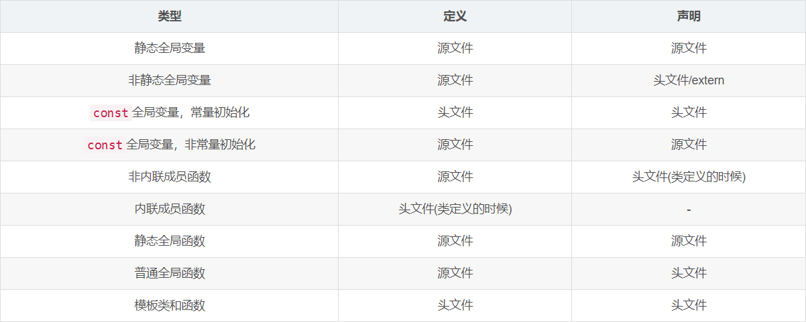

#### Chapter 15 面向对象程序设计
1. 面向对象核心思想：数据抽象、继承和动态绑定

2. 在C++语言中，基类将**类型相关的函数**与派生类**不做改变直接继承**的函数区分对待。

对于某些函数，基类希望它的派生类各自定义适合自己的版本，此时**基类**就**将这些函数声明为虚函数**。

派生类如果要对这些操作提供自己的新定义覆盖则可以在函数后加override关键字

如果基类不希望某一个函数被派生类覆盖，则可以添加final关键字
```C++
class Quote{
public:
    std::string isbn() const;
    virtual double net_price(std::size_t n) const;
    void f1(int) const final; // 不允许后续的其他类覆盖f1
};

class Bulk_quote : public Quote{
public:
    double net_price(std::size_t) const override;
};

```

3. 派生类必须在其内部对所有重新定义的虚函数进行声明。

4. 动态绑定：运行版本由实参决定，即在运行时选择函数的版本，所以动态绑定又称运行时绑定。

一般在使用**引用（或指针）**调用一个虚函数时会发生动态绑定。

非引用非指针表达式调用虚函数一般编译时就可以确定版本，不会动态绑定。

而那些非虚函数总是静态绑定，只和指针或者引用的类型有关，指针类型是A类型，即使绑定到了B类型上，也还是会调用A类型中的函数。

（任何条件下都要禁止重定义继承而来的非虚函数）

5. 作为继承关系中根节点的类通常会定义一个虚析构函数。

即基类通常应该定义一个虚析构函数。

6. 任何构造函数之外的非静态函数都可以是虚函数。

关键字virtual只能出现在类内部的声明语句之前而不能用于类外部的函数定义。

7. 成员函数如果没被声明为虚函数，则其解析过程发生在编译时而非运行时。一般这类函数代表基类希望派生类直接继承而不要改变的函数。

8. protected：基类希望其派生类有访问权限而其他用户禁止访问。

此外，还有一条重要规则：
> 派生类的成员或友元只能通过派生类对象来访问基类的受保护成员。派生类对于一个基类对象中的受保护成员没有访问特权

```C++
class Base{
protected:
    int prot_mem; // protected 成员
};
class Sneaky : public Base{
    friend void clobber(Sneaky &); // 能访问Seanky::prot_mem
    friend void clobber(Base &); // 不能访问Base::prot_mem
};
```

如果派生类及其友元可以访问基类的protected对象，则Sneaky对象里的第二个友元函数可以访问Base::prot_mem，但其不是Base的友元，也就相当于躲过了protected，这显然是不合理的。

9. 大多数类都只继承自一个类，称为“单继承”

10. 在**一个对象中，继承自基类的部分和派生类自定义的部分不一定是连续存储的！**  😎

11. 由于在派生类对象中含有基类的部分组成成分，所以我们可以把派生类的对象当成基类对象来使用，而且我们也可以将基类的指针或者引用绑定到派生类对象中的基类上

**编译器会隐式地执行派生类到基类的转换。但是这种自动转换只对指针或者引用有效**

因为派生类对象中有基类成分，所以这种转换肯定是安全的。

```C++
Quote item; // 基类对象
Bulk_quote bulk; // 派生类对象
Quote *p = &item; // p指向quote对象
p = &bulk; // p指向bulk的Quote部分
Quote &r = bulk; // r指向bulk的Quote部分
```

**但是不存在基类到派生类的转换！**
```C++
Quote base;
Bulk_quote *bulkP = &base; // 错误
```
如果上述赋值合法，则我们可能会使用bulkP访问base种根本不存在的成员。

12. 派生类必须使用基类的构造函数来初始化它的基类部分。

13. 每个类必须负责定义各自的接口，要想与类的对象交互必须使用该类的接口，即使这个对象是派生类的基类部分也是如此。

派生类对象应该遵循类的接口，并通过调用基类的构造函数来初始化那些从基类中继承而来的成员，而不是直接在自己的构造函数里直接初始化。

14. 静态成员/函数：不论从基类中派生出来多少个类，对于每个静态成员来说都只存在唯一的实例。

15. 类的声明中不能包含派生列表，派生列表必须和类的主体一起出现。

16. 防止继承的发生：类名后加final关键字，表示不希望或不考虑别的类继承它

```C++
class NoDerived final {};
class Base {};
class Last final : Bse { };
```

17. 表达式的静态类型总是已知的，它是变量声明时的类型或表达式生成的类型。

动态类型则是变量或者表达式表示的内存种的对象的类型。动态类型直到运行时才可知。

最典型的动态就是多态的使用。

如果表达式既不是引用又不是指针，则动态类型永远与静态类型一致。

例如，Quote类型的变量永远是一个Quote对象。

18. 存在**派生类向基类的隐式类型转换**，但是**不存在从基类向派生类的隐式类型转换**

如果要将基类的指针或引用转换为派生类的指针或引用，使用dynamic_cast

19. 在派生类和基类之间不存在类型转换，只是调用对应的构造函数或者赋值运算符

```C++
Bulk_quote bulk; // 派生类对象
Quote item(bulk); // 使用Quote::Quote(const Quote&）构造函数
item = bulk; // 使用Quote::operator=(const Quote&) 赋值运算符
```

但是在用一个派生类对象为一个基类对象初始化或赋值时，只有该派生类对象中的基类部分会被拷贝、移动或者赋值，派生类自己的部分将被忽略掉。

20. 所有虚函数都必须有定义。

通常来说，如果不使用某个函数，则无须提供定义。

但是必须为每一个虚函数提供定义，而不管它是否被用到了，这是因为编译器也无法确定到底会使用哪一个虚函数。（运行时绑定）

21. 如果虚函数使用默认实参，则基类和派生类中定义的默认实参最好一致

22. 如果不想动态绑定，可以通过作用域运算符显式调用回避动态绑定机制

一般当一个派生类的虚函数调用它覆盖的基类的虚函数版本时才会这么做。

23. 虚函数表(vfptr)底层原理

* 基类大小多出几个字节，是一个指针_vfptr，\_vfptr指向一个函数指针数组
  数组中保存所有虚函数的地址
* 派生类继承基类，会继承基类的函数指针数组里的元素
* 如果派生类有重写，那么重写后的函数地址会覆盖函数指针数组里的函数地址
* 调用函数时，会去本类的虚函数表中找函数
* 虚函数表对于每一个类只有一个，而不是一个对象一个。

多态的程序在运行时有额外的时间（调用时要去虚函数表中查找，多态的函数调用编译较慢），空间（虚函数表）开销

显式调用虚函数：
```C++
class A_A{
public:
    virtual void show() const { printf("A show!\n"); }
};
class B_B : public A_A{
public:
    void show() const override { printf("B show!\n"); }
    virtual void show2() { printf("B show2!\n"); }
};


int main()
{
    B_B b_b;
    using PFun = void (*)();
    PFun **vfptr = reinterpret_cast<PFun **>(&b_b);
    vfptr[0][0](); // B show
    vfptr[0][1](); // B show2
    return 0;
}
```
图例如下：


函数指针强转成二维的，因为对象中有其他元素

在函数指针二维数组中取[0]即\*__vptr，而vptr又指向了一个函数指针数组

调用vptr[0]则调用了show()，vptr[1]则调用了show2()

24. 抽象基类

如果一个类中的某个函数只表示一种概念，而不希望用户直接调用，则可以将该函数声明成纯虚函数。

声明纯虚函数的方法：在函数体的分号之前写=0

```C++
class xxx
{
...
    double net_price() = 0;
...
}
```

一个纯虚函数无需定义且**含有纯虚函数的类是抽象基类**且**不能创建抽象基类的对象**。（往往这些类只是存储了一些接口变量或者函数而无实际的意义）

可以定义派生类的对象，前提是**这些类覆盖了纯虚函数**

25. 派生访问说明符

一个类从某个类继承而来时可以选择public或者protected或者private继承。

派生访问说明符对于派生类中的成员或者友元能够访问基类对象没什么影响。

但是，派生访问说明符控制了**派生类用户以及派生类的派生类对基类的访问权限**。

```C++
class Base
{
public:
    void pub_mem();
protected:
    int prot_mem;
private:
    char priv_mem;
};
struct Pub_derv : public Base
{
    // 正确，派生类能访问protected成员
    int f() { return prot_mem; }
    // 错误，派生类不能访问private成员
    char g() { return priv_mem; }
};
struct Priv_derv : private Base{
    // 正确，派生访问说明符不影响成员或友元，只影响对象
    int f1() const { return prot_mem; }
};

Pub_derv d1;
Priv_derv d2;
d1.pub_mem(); // 正确
d2.pub_mem(); // 错误，因为是private派生
```

如果要改变其中的个别权限，可以通过增加using声明来实现。

改变之后Priv_derv的对象可以使用pub_mem，其派生类可以使用prot_mem
```C++
struct Priv_derv : privart Base{
public:
    using Base::pub_mem;
protected:
    using Base::prot_mem;
};
```

26. 友元关系不能传递和继承，但是**可以访问派生类中基类内嵌在派生类中的那部分**
```C++
class Base{
    friend class Pal;
protected:
    int prot_mem; // protected 成员
};
class Sneaky : public Base{
    friend void clobber(Sneaky &); // 能访问Seanky::prot_mem
    friend void clobber(Base &); // 不能访问Base::prot_mem
};

class Pal{
public:
    int f(Base b) { return b.prot_mem; } // 正确，Pal是Base的友元
    // 错误，Pal不是Sneaky友元，不能访问Sneaky独有的部分
    int f2(Sneaky s) { return s.j; }
    // 正确，Pal是Base的友元，可以访问Sneaky的Base部分
    int f3(Sneaky s) { return s.prot_mem; }
};
```

27. struct和class除了默认成员访问说明符和默认派生说明符(class默认private和private派生，struct默认public和public派生），没有其他区别

28. 派生类的作用域位于基类作用域之内，除了覆盖继承而来的虚函数之外，派生类最好不要重用其他定义在基类中的名字

即使参数列表不一致，基类函数也会被隐藏掉

29. 继承关系对基类拷贝控制最直接的影响是**基类**通常应该定义一个虚析构函数

如果我们自己没有定义，编译器生成一个虚析构函数

这样在销毁对象时，就能运行正确的析构函数版本💪

**反过来思考，如果基类的析构函数不是虚函数，那么我们如果用基类的指针或者引用指向派生类，再释放该指针指向的空间，则只会调用基类的析构函数，即只释放了基类的资源，而没有释放派生类对应的资源。**

30. 对于派生类的析构函数来说，先析构派生类，再调用直接基类的析构函数去析构继承来的基类部分，再调用直接基类的直接基类，以此类推直到继承链的顶端。

构造和析构的顺序刚好相反。

派生类的析构函数本身只负责销毁派生类自己分配的成员，要调用基类的析构函数才能完整销毁。如果不显示地调用则编译器会自动执行基类地析构函数。

31. 当我们在继承关系中需要用到移动操作时应该首先在基类中进行定义。

因为基类缺少移动操作会阻止派生类拥有自己的合成移动操作。

派生类的拷贝和移动，也要拷贝和移动基类部分的成员。

```C++
D &D::operator=(const D &rhs)
{
    Base::operator=(rhs); // 为基类部分赋值
    // 在这里自己释放资源
    return *this;
}
```

32. 一个类只能继承直接基类的构造函数，类不能继承默认、拷贝和移动构造函数。如果要用的话需要类里面显式定义一个。

```C++
class Bulk_quote : public Disc_quote{
public:
    using Disc_quote::Disc_quote; // 继承Disc_quote的构造函数
    double net_price(std::size_t) const;
}
```

33. 当使用容器存放继承体系中的对象时，应该存储指针而不是对象（必须是间接存储）

如果存的是对象，则通常派生类部分会被忽略掉。

实际上存放的通常是基类的指针（更好的选择是智能指针）

```C++
vector<shared_ptr<Quote>>basket;

basket.push_back(make_shared<Quote>("100", 1));

basket.push_back(make_shared<Bulk_quote>("100", 1);

```

34. 对于C++面向对象编程来说，一个悖论是我们无法直接使用对象进行oop，相反，我们必须使用指针和引用。

35. 派生类应当反映与基类的是一种“Is A”的关系。在设计良好的类体系中，公有派生类对象应该可以用在任何需要基类对象的地方。

类型之间的另一种关系是一种“Has A”关系，具有这种关系的类暗含成员的意思。

36. 重构：负责重新设计类的体系以便将操作或数据从一个类移动到另一个类中。

对于面向对象的应用程序来说，重构非常普遍。

37. 头文件和源文件中定义的：
