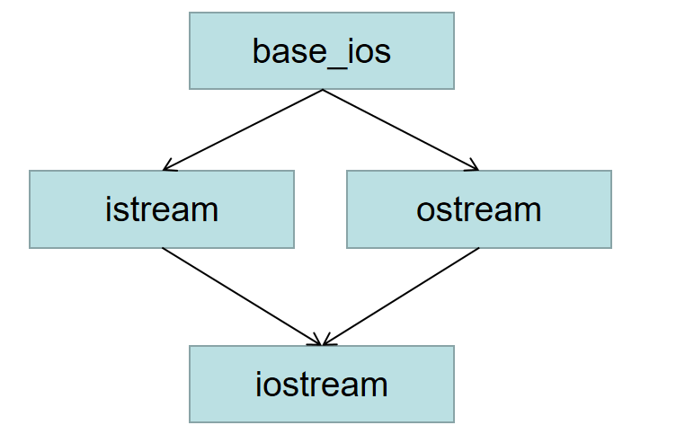

#### Chapter 18 用于大型程序的工具
1. 异常处理

C++中通过抛出（throw）一条表达式来引发一个异常。

被抛出的表达式的类型以及**当前的调用链**共同决定了哪段处理代码将被用来处理该异常。

**当执行一个throw时，跟在throw后面的语句将不再被执行。相反，程序的控制权从throw转移到与之匹配的catch模块。**

* 沿着调用链的函数可能会提前退出
* 一旦程序开始执行异常代码，则沿着调用链创建的对象将被销毁。

2. 栈展开

如果对抛出异常的函数的调用语句位于一个try语句块内，则检查与该try块管理的catch子句。如果找到了匹配的catch，就使用该catch处理异常。

否则，如果该try语句嵌套在其他try块中，则继续检查与外层匹配的catch子句

这个过程被称为栈展开，在栈展开的过程中对象会被自动销毁。

由于析构函数大部分情况下掌控了释放资源的代码，所以不应该也不太可能抛出异常。所有标准库类型都能确保它们的析构函数不会发生异常。

3. 捕获异常

catch的参数可以是左值引用，但不能是右值引用。

如果catch的参数是基类类型，则可以使用其派生类的异常对象对其进行初始化。但是此时如果catch的参数是非引用类型，则异常对象将被切掉一部分（与将派生类对象以值传递的方式传给一个普通函数差不多）。另一方面，如果catch的参数是基类的引用，则该参数将以常规方式绑定。

4. catch语句可以串联

```C++
catch (my_error &eObg)
{
    xxx
}
catch(other_error eObj)
{
    xxx
}
```

5. catch(...)可以捕获所有类型的异常。一条捕获所有异常的语句可以与任意类型的异常匹配。

6. 如果想处理构造函数初始值抛出的异常，我们必须将构造函数写成函数try语句块。

可以将构造函数置于一个try语句块中，如下。

```C++
template <typename T>
Blob<T>::Blob(std::initializer_list<T> il) try:
    data(std::make_shared<std::vector<T>>(il))
    { 
        xxx // 空构造函数体
    }
    catch (const std::bad_alloc &e)
    {
        handle_out_of_memory(e);
    }
```

7. noexcept异常说明

对于用户以及编译器来说，预先知道某个函数不会抛出异常将大有裨益。

* 简化调用该函数的代码
* 如果编译器确认函数不会抛出异常，它就能执行某些特殊的优化操作，而这些优化操作并不适用于可能出错的代码。

如果某个函数是noexcept的，编译器并不会在编译时检查noexcept说明。

如果一个虚函数承诺了它不会抛出异常，则其后续派生出来的虚函数也必须做出同样的承诺。

相反，如果基类的虚函数允许抛出异常，则派生的对应函数可以允许，也可以不允许。

8. 建立自己的异常类体系（通过继承标准异常类）

```C++
class out_of_stock: public std::runtime_error{
public:
    explicit out_of_stock(const std::string &s): std::runtime_error(s) { }
}

throw out_of_stock("Out of Stock!");
```

9. 命名空间

大型程序会使用多个独立开发的库，这些库又会定义大量的全局名字，但是当应用程序用到多个供应商提供的库时，不可避免地会发生某些名字相互冲突地情况。通过在某个命名空间中定义库的名字，库的作者以及用户可以避免全局名字固有的限制。

命名空间可以是连续的，也就是说，可以在程序的多个地方定义相同的namespace。

这个特性可以使我们将几个独立的接口和实现文件组成一个命名空间。

.h 和 .cpp 分开，但是同一个类在同一个命名空间内。

但是注意，通常情况下，我们不把#include放在命名空间内部。因为这么做意味着我们把#include里的东西也包括在了命名空间里面。

10. global namespace

全局作用域是隐式的，没有名字
```C++
::member_name 表示全局命名空间中的一个成员。
```

11. 命名空间也可以嵌套。嵌套则使用多个::访问

**内联命名空间**：

内联命名空间中的名字可以被外层空间直接使用。

```C++
inline namespace FifthEd{
    class Query_base...
}

namespace FourthEd{
    class Query_base...
}

namespace cplusplus_primer{
    #include "FifthEd.h"
    #include "FourthEd.h"
}

cplusplus_primer::Query_base; // 因为FifthEd是内联的，所以可以直接访问
cplusplus_primer::FourthEd::Query_base; // FourthEd不是内联的，所以要给出名字
```

12. using声明：一次引入命名空间的一个成员，使得程序清楚知道用的哪个名字。

using std::cout;

using namespace std; // 使用整个std空间中的名字，但是比较危险

13. 同时支持namespace的赋值

namespace primer = cpulusplus_primer;

14. 实参相关的查找：当我们给函数传递一个类类型的对象时，除了在常规作用域查找外还会查找实参类所属的命名空间

```C++
std::string s;
std::cin >> s;

// 与上面一条语句等效
// 我们可以不用std::限定符和using声明就可以调用operator
// 因为函数在实参范围内也进行了查找
operator>>(std::cin, s);
```

15. 对于重载函数，using声明载入了所有版本

16. 多重继承：多重继承的派生类从每个基类中继承状态。

* 多重继承中的派生类的构造、拷贝、移动操作
* 多重继承中的类型转换
* 多重继承中基于指针类型或引用类型的查找

这些操作基本和单继承中的一样。

17. 虚继承

拟解决的问题：如下图所示


iostream继承了base_ios两次，这会使得iostream类多次包含base_ios的多个子对象，

一个iostream对象肯定希望在同一个缓冲区中进行读写操作，也会要求条件状态能同时反映输入和输出操作的情况。假如在iostream对象中真的包含了base_ios的两份拷贝，则上述的共享行为就无法实现了。

采用虚继承可以解决该问题，如果一个类声明成虚的，则表明愿意和其他类共享基类。

在本例中在istream和ostream继承时声明为虚继承即可。

```C++
class istream : public virtual base_ios { }
class ostream : public virtual base_ios {  }
```

18. 多重继承的细节十分复杂，远非概念上如此简单。