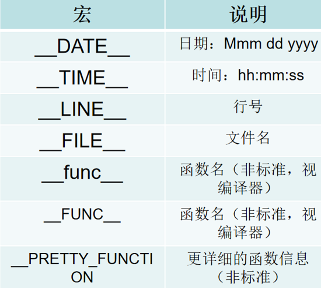
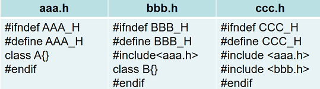
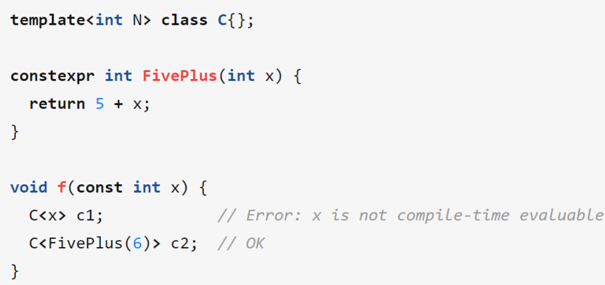
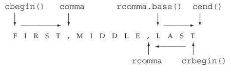
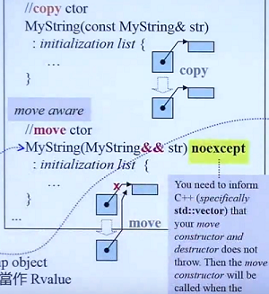
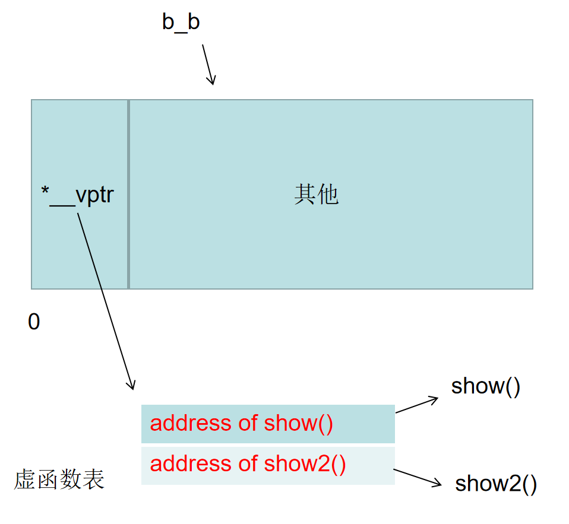
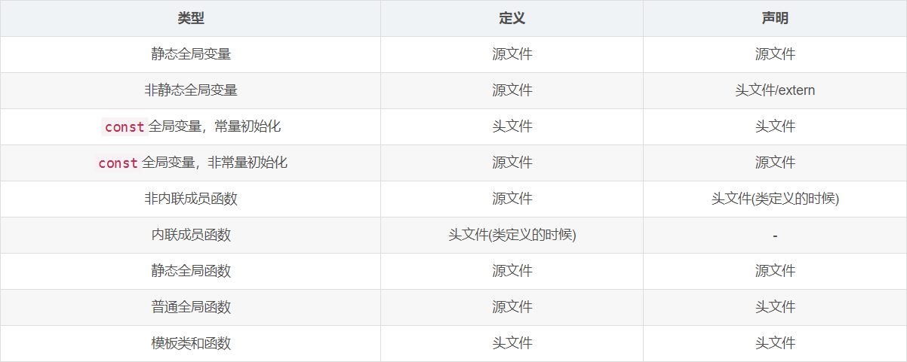
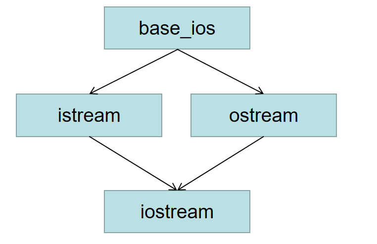

### Chapter 1 概述
1. C++文件后缀不仅有cpp，还有cc； C； cxx等
2. 文件重定向命令：Windows下  **xxx.exe**  <input_file> output_file 
>linux下也相同，xxx <input_file> output_file


3. 缓冲区 buffer，IO设备通常将输入输出数据保存在一个缓冲区中
 
4. 多行注释规范书写
```C++
/*
 *
 *
 */
```

源码函数注释编写：
```C++
/**
 *  @brief 对函数功能的简述
 *  @param __x 函数中出现过的变量说明
 *  @return 说明函数的返回
 *  other despcritions or notations
 */

/** 
 *  @note 提示点
 */
```

文件头

```C++
/***************************************************************************
 *  @file       main.cpp
 *  @author     Alan.W
 *  @date       01  Feb 2014
 *  @remark     This code is for the exercises from C++ Primer 5th Edition
 *  @note
 ***************************************************************************/
```

5. 预处理名字由预处理器提供而非编译器管理，调用时直接使用即可，由编译器管理的使用时才需要std::或者xxx::来声明

#include，#define都是预处理定义

在编译前，预处理阶段处理这些预处理定义
一些内置宏：




---
### Chapter 2 变量和基本类型
1. 注意**内存对齐**问题（408知识点）

2. C++11标准下，可以用列表花括号初始化一切，包括变量
3. extern关键字，只是声明一个外部的全局变量，并没有定义（理解还不是很深）
一般将所有全局变量和全局函数都放在一个*.cpp文件中，然后用同一个同名的*.h包含所有函数和变量声明
4. C++静态语言，所以在编译阶段就检查所有类型，编译器必须知道每一个实体对象类型
python为动态解释性语言，所以不需要声明类型
5. 命名规范
* 变量名一般用小写字母
* 用户定义的类名一般以大写字母开头
* 单词间应该有明显区分，下划线分隔或者驼峰命名

6. 引用即起别名，是一种左值引用，必须初始化（绑定在实际的对象上）

7. void * 指针
8. 顶层const：即指针本身是一个常量如  **int \* const p1 = i;**
底层const：指针所指向的对象是一个常量如 **const int \* p2 = i;**

9. decltype()只分析表达式类型，不会执行实际的计算 
decltype((i)) d ，双层括号声明了引用，如果i是int型，则d为int &
decltype(i) d，单层括号则d为int类型

```C++
// 较有技术想象力的模板加法实现
template<typename T, typename U>
auto add(T a, U b) -> decltype(a + b){
    return a + b;
}

// lambda表达式

auto add4 = [](int a, int b)->int
{
    return a + b;
};

```

10. 头文件保护符：用来防止某一些文件重复定义



11. constexpr函数 指能用于常量表达式赋值的函数，被隐式地指定为inline函数

---
### Chapter 3 字符串，向量和数组
1. 有符号数和无符号数一起操作，则有符号数会自动转换为无符号数

2. string类型取下标，其实属接受的输入参数是string::size_type类型，而不是常用的int类型，只不过int类型会转换成该类型
3. 用emplace_back()代替push_back()
4. vector类型的下标是vector<type>::size_type类型，所以取下标操作其实是对应类型的size_type
5. 迭代器和！=适用于所有容器类型
6. cbegin()和cend()代表const begin和const end，不能通过该迭代器修改对应信息
7. 使用数组下标时，通常使用size_t类型，**基本所有下标都是无符号整数类型（除了map）**

---
### Chapter 4 表达式
1. 关于左值和右值
* 以常量对象为代表的某些左值实际上不能作为赋值语句的左侧运算对象。
* 当一个对象被用作右值的时候，用的是对象的内容。当一个对象被用作左值的时候，用的是对象的身份（在内存中的位置）
* 在需要右值的时候可以用左值来代替，但不能把右值当作左值使用
* 解引用，string和vector下标运算符等得到的结果均为左值
* 如果表达式的结果是左值，则decltype将得到一个引用类型，如int \*p; decltype(\*p); decltype(a[0])等
* 普通的算术表达式是右值
2. 递增运算符优先级高于解引用运算符
3. 箭头运算符作用域一个指针类型的运算对象，结果是一个左值。而点运算符得到的类型取决于城院所属对象
4. 位运算符和1，0以及移位运算符相结合的活学活用
5. sizeof()运算符返回一个size_t类型
6. 显示强制类型转换（应该尽量避免使用）
格式：
```C++
cast-name<type>(expression);
```
tpye为要转换的目标类型，如果type是引用类型则目标是左值。9
而cast-name可选以下四种:

* static_cast：只要不包含底层const，则都可以使用明确定义的static_cast
* dynamic_cast：将一个基类对象指针（或引用）转换到继承类指针
* const_cast： 只能改变对象的底层const，转换成的type必须是指针或者引用
* reinterpret_cast： 用于指针间的转换

#### Chapter 5 语句
1. C++异常处理
try……catch语句
```C++
try
{
    program-statements
}
catch(const std::exception& e)
{
    std::cerr << e.what() << '\n';
}
```
exception类不可以赋初值
而throw其他异常类（在头文件stdexcept），如runtime_error等，必须赋初值，一般是一个字符串

```C++
throw runtime_error("Data must be a digit")
```

---
#### Chapter 6 函数
1. 名字有作用域，对象有生命周期

2. static：使得局部变量的**生命周期**贯穿函数调用以及之后的时间，直到程序终止才销毁。如果静态局部变量没有显式初始值，则它默认初始化的局部静态变量为0。

3. 建议在头文件.h中声明变量和函数，而定义在具体的.cpp源文件中
声明作用在编译阶段，定义作用在链接阶段
定义和声明分开是工程开发的规范，有更多的好处


4. 源文件->预处理->编译->汇编->链接->装入->可执行文件

编译阶段只执行语法检查，所以如果某个函数只有声明没有定义编译阶段不会报错，在链接阶段才会报错。

g++ -E test.cc可以查看预处理之后的待编译源码

gcc -c test.cc 会生成test.o

命令 nm -C test.o可以查看对象文件中的各种定义

链接多个对象文件，直接**g++ a.o b.o**即可

5. 函数中引用传递，引用形参是对应实参的别名，且使用引用参数可以使函数返回多个值

6. 使用引用可以避免不必要的拷贝，当函数无需修改引用形参的值时最好使用常量引用

7. 顶层const作形参需要注意的点

顶层const作为形参时，即可以传入const对象，也可以传入非const对象

而当用实参初始化形参时会忽略掉该顶层const
```C++
void fcn(const int i){}; // fcn可以读取const和非const对象，但是不能改变i
void fcn(int i); // 错误，重复定义，因为上面函数顶层const被忽略了和该函数完全相同
```

8. 如果不改变对象值，则参数尽量使用常量引用

9. **常量引用可以绑定非常量和常量，而普通引用不能绑定到常量上**

10. 指针标准库函数:begin()和end()
>尽管能计算得到尾后指针，但容易出错，因此C++标准库为指针提供了名为begin和end的函数（end返回的时尾元素的下一位置）
>如int \*beg = begin(a)， int \*last = end(b)

采用数组作为函数参数时，尽量使用标准库规范：传递指向数组首元素和尾后元素的指针，这样可以安全地访问到数组
```C++
void print(const int *beg, const int *last)
{
    // 输出[begin, end)的所有元素
    while(begin != end)
        cout << *beg++ << endl;
}
int a[5] = {1, 2, 3, 4};
print(begin(a), end(a));
```

11. main函数地参数一般是通过命令行传入
```C++
// 第一个参数argc代表数组中字符串的数量，第二个argv每个元素代表命令行提供的字符串
int main(int argc, char *argv[]) {……}
// 或者
int main(int argc, char **argv) {……}
```
举例：（prog是一个可执行文件)

如命令行指令：prog -d -o ofile data0 

则argc应该等于5，argv是一个数组，其中各值如下（以空格分割）

argv[0] = "prog";

argv[1] = "-d";

argv[2] = "-o";

argv[3] = "ofile";

argv[4] = "data0";

argv[5] = 0;

用处：比如在读取文件的时候，可以允许从命令行键入文件的path

12. 如果函数的参数数量是可变的，可以用initializer_list或者vector可变作为参数

13. 设计函数返回时，应该保证在任意一条控制流下，函数都能正常返回值

14. 返回也可以返回引用类型，返回非引用类型会发生拷贝，返回引用类型则不会（但是需要注意，**永远不能在函数中返回局部变量/常量的引用**！）

所以一般返回引用时，会返回传入参数的引用

15. 函数可以返回花括号包围的值的列表

```C++
vector<string> process()
{
    return {"function", "okay"}
}
```

16. cstdlib中两个常量：EXIT_FAILURE和EXIT_SUCCESS作为主函数返回状态

标准库定义该两个常量是为了使得返回值和机器无关，不同机器上0，1，2等main返回值代表不同的意思

17. 重载函数：为操作非常相似的函数进行重载

重载函数名和参数类型不能完全相同（这里尤其注意顶层const作为形参）

18. C++函数默认参数，必须放在函数参数列表的最后（**局部**变量不能作为默认实参）

19. 为什么引入inline函数？

因为一些简单的小操作封装成函数有利于重复利用以及修改

但是调用函数比调用等价的表达式要慢，因为函数调用需要保存寄存器如PC以及一些标志寄存器，并在返回时恢复（类似于保存断点，返回现场）；并且可能需要拷贝实参

使用内联函数则编译器会将**inline函数内的函数体直接插入到调用处**，避免了上述费时操作

注意，编译器会自动优化程序，使得某一些函数优化成内联函数。并且inline只是一个建议，并不是说声明了inline最终就是内联的，要看编译器如何优化

那么，省略了调用，代价是什么呢？代价就是会造成程序长度变大，所以如果inline太多会使得程序运行时占用的内存空间非常大，因为到inline的地方就是直接代码段插入，多次调用会使得程序膨胀，所以只建议用于小函数

20. constexpr什么用? 感觉还是很难理解

constexpr声明的函数是一种内联函数

const修饰的可以被常量表达式初始化，也可以被编译器不能计算出值的表达式初始化

而constexpr修饰的函数，一定要用常量表达式初始化或者作为返回值，一定可以用于指定数组的大小

const强调变量不能被修改，而constexpr直接声明常量



（没看懂==，后面复习的时候再理解）

constexpr是真正的常量，在编译器和运行期都是常量
但是const只是编译器常量

21. 一般而言，inline函数和constexpr函数的**定义**放在头文件内

22. assert预处理头文件：cassert

```C++
assert(expression)
```
assert宏常用于检查不能发生的条件。

assert行为以来一个叫NDEBUG的预处理变量的状态。

如果定义了NDEBUG，则assert什么也不做。

在程序中#define NDEBUG

或者在命令行中gcc -D NDEBUG main.cc

23. 除了用assert，也可以用NDEBUG来编写自己的条件调试代码

```C++

void print(const int ia[], size_t size)
{
    #ifndef NDEBUG
        // __func__是编译器定义的一个内置宏，用来存放函数名字
        // 相同类型的还有__FILE__，__LINE__等
        cerr << __func__ << "array size is" << size << endl;
    #endif
}
```

24. 函数指针，函数式编程

函数指针：一般该指针由括号括起来
bool (\*pf) (const string &, const string&);
// pf指向一个函数，该函数参数是两个const string的引用

bool lengthCompare(const string &, const string &);
pf = lengthCompare; //使用时直接将函数名赋值给函数指针即可

25. **对C++函数返回的理解**（**极其重要！**）

* 返回值
返回一个值和初始化一个变量或者形参的方式完全一样：返回的值用于初始化调用点的一个临时量，该临时量就是函数调用的结果。（对类也同样生效）

```C++
string make(const string& s)
{
    return s;
}

string s = "asda";
string t = make(s);
```

中间执行的过程：调用make时，生成一个临时的string变量temp，然后temp再用来初始化t

等价于：string temp(s); string t(temp);

因此，如果一个函数有返回值，调用完没有被赋值给对应对象，则其实一直是中间的temp对象在工作生效。不好好理解这个很可能编程时出现问题（见练习7.27，7.28)。

* 返回引用
返回引用，则该引用仅仅是它所引对象的一个别名，中间不会生成拷贝对象。

函数传参时也是同理。

---

#### Chapter 7 类
1. 在类中，成员函数使用this的额外参数来访问调用它的那个对象

this是一个常量指针，调用它的对象的**常量指针**

定义类似如：A* const this，A为某个类，所以this不能绑定到其他对象上

2. 类中在参数列表后的const关键字：修改隐式this指针类型

使得this指针指向的是常量对象，即在该函数体下this指针指向的内容不能改变

声明如：const A* const this

这样使用const的成员函数被称为常量成员函数

当一个成员调用另一个成员时，this指针会在其中隐式地传递

3. 编译器分两步处理类：首先编译成员的声明，然后再编译成员函数体

因此，成员函数体可以随意使用类中的其他成员而无须在意这些成员的出现顺序

4. 定义在类外的函数，前面需要包含类名

编译器一旦看到这个函数名，就能理解剩余的代码是位于类的作用域内的，因此定义在类外的函数也可以随意使用本类内的成员

5. 返回this指针一般和返回类型是引用相结合

6. IO类属于不能被拷贝的类型，因此如果参数是istream,ostream，则一定要加引用
7. 构造函数不能被声明成const的，当我们创建类的一个const对象时，直到构造函数完成初始化过程，对象才能真正取得其“常量”属性

8. C++11中，如果需要默认的行为，那么可以在参数列表后协商=default来要求编译器生成构造函数，如
```C++
struct Sales_data()
{
    Sales_data() = default; // 要求编译器生成默认构造函数
    Sales_data(const std::string &s, unsigned n, double p):bookNo(s), units_sold(n), revenue(p*n){}
}
```

9. 构造函数初始化列表：负责为新创建的对象的一个或几个数据成员赋初值

如上一条中的第二个构造参数

如果成员是const，引用，或者属于某种未提供默认构造函数的类类型，我们必须通过构造函数初始值列表为这些成员提供初值

并且最好令构造函数初始值的顺序与成员声明的顺序保持一致

```C++
// 例子
class ConstRef
{
    public:
        ConstRef(int ii);
    private:
        int i;
        const int ci;
        int &ri;
};
ConstRef::ConstRef(int ii)
{
    i = ii; // 正确
    ci = ii; // 错误，不能给const赋值
    ri = ii; //错误，ri是引用，还没有绑定对象
}
// 正确，使用参数列表初始化
ConstRef::ConstRef(int ii):i(ii), ci(ii), ri(ii){}
```

10. struct默认访问权限是public，而class默认访问权限是private

11. 友元：允许其他类或者函数访问自身的非公有成员

一般来说，最好在类定义开始或者结束前的位置集中声明友元
而定义一般放在外部

注意：友元不存在传递性。

12. 可变数据成员mutable，一个可变数据成员永远不会是const，即使它是const对象的成员

可变数据成员即使在const函数中也可以改变。

13.如果一个类想把一组重载函数声明成友元，它需要对这组函数中地每一个分别声明

14. 友元地作用只是影响访问权限，自身并非普通意义上的声明。

15. 委托构造函数：可以在某个构造函数中调用其他的构造函数，使得可以使用其他构造函数的一些功能，而不用再自己写一大堆🆒

example:
```C++
class SalesData
{
    public:
        SalesData(std::string s, unsigned cnt, double price):
            bookNo(s), units_sold(cnt), revenue(cnt*price){}
        // 委托上一个构造函数帮自己完成某些初始化
        SalesData(std:istream &is):SalesData("", 0, 0) {read(is, *this)}
};
```

16. 类内构造函数explicit：防止函数传入的对象进行了隐式转换

比如：如果一个函数的参数是string类型的，则istream类型对象传入会被自动转换
如果又想重载一个stream类型的函数，则会产生二义性问题。
这个时候将其声明为explicit类型即可。


17. 构造函数可以被声明为constexpr类型，用于生成constexpr对象

18. 类中的static

静态成员变量：类的静态成员存在于所有对象之外，相当的全局成员，只有一个静态成员且被所有的类对象共享

一般静态成员不在类的内部初始化。

不过constexpr类型声明的静态成员可以在类内初始化。

声明：static constexpr int xxx = 3;

静态成员函数：与静态成员相同，不与任何对象绑定在一起，所以不包含this指针，因此，静态成员函数不能声明成const的，并且我们也不能在static函数体内使用this指针

访问静态成员直接 **类名::成员名**即可

在类的外部定义静态成员时，不需要重复static关键字

19. 聚合类：只有公有成员，没有构造函数的类。可以直接用花括号的初始值列表初始化

---
#### Chapter 8 IO库
1. IO类：iostream, fstream（针对文件），sstream（针对字符串）

在这些类中，iostream分为istream，ostream

fstream分为ifstream，ofstream

sstream分为istringstream，ostringstream

2. IO类型不能拷贝或者赋值

因此如果函数返回IO类型对象，一般会返回引用

3. endl操纵符会显式刷新缓冲区（少用）并输出一个回车

flush会刷新缓冲区，但不加任何字符

4. 如果有一个函数接收一个ostream &参数，我们在调用这个函数时，可以传递给它一个ofstream对象，对istream和ifstream也是类似的

5. sstream头文件，string流，可以从string等读取数据，就像string是个IO流一样

istringstream，可以读一个字符串形成一个istringstream对象

ostringstream，可以存一个字符串

\>>和<<箭头的方向就是流的方向

---
#### Chapter 9 顺序容器
1. 顺序容器：vector, deque, list, forward_list, array, string

2. 只有连续内存空间的容器才能用下标访问

3. forward_list是前向链表，所以迭代器不支持递减

4. 元素范围: [begin, end)

5. 迭代器：begin()，end()，rbegin(), rend(), cbegin(), cend()， crbegin(), crend()

    vector<int>::const_iterator 代表常量迭代器

    不过需要注意的是，以c开头的函数都是被重载过的。

    一个是const成员，返回const_iterator类型。

    一个是非const成员，返回iterator类型。
    
6. 可以在不了解容器中元素类型的情况下使用它。

如果需要元素类型，可以使用容器的value_type

如果需要元素类型的一个引用，可以使用referenece或者const_reference

7. 只有顺序容器（不包括array）的构造函数才接受大小参数。

因为array的大小是类型的一部分且声明后就固定不变，如

```C++
array<int> 
array<int, 42> // 42个int元素
```

8. 如果创建一个容器为另一个容器的拷贝，则两个容器类型必须匹配

如果用迭代器范围来拷贝，则不需要

如vector<int> vec(S.begin(), S.end()), S为set<int>类型

9. 顺序容器中还有很多使用的操作函数

c1.swap(c2)：使用交换函数，比从c2向c1拷贝元素快得多

seq.assign(b, e)

将seq中的容器替换为迭代器b和e所表示的范围中的元素

10. 将元素插入到vecot，string，deque的任何位置都是合法的，但是可能很耗时

insert返回插入的元素的位置

vector和string的insert和earse不仅有迭代器版本，还有下标类型版本

11. emplace_back()，emplace(), emplace_front()会在容器管理的内存空间中直接创建对象

而调用push_back()则会创建一个临时对象, 所以emplace_back效率较高

12. 所有的顺序容器都有front()和back()，forward_list（单向链表)不支持back()

13. 检查下标是否合法可以用at函数，如果传入的下标越界，则会抛一个out_of_range异常

14. erase()函数可以删除指定迭代器位置的数，也可以删除一对范围内的数

但是erase掉后应该将迭代器设置为删除元素之后的元素（即erase的返回值）

15. 由于通过迭代器向容器中添加元素和删除元素的代码可能使迭代器失效，所以必须保证每次改变容器的操作后都正确地重定位迭代器

16. 不要保存end()返回地迭代器，因为容器操作会使得迭代器失效

17. vector的size是容器中实际元素的个数，capacity是实际分配到的内存空间，会动态增长

18. string的substr函数只能使用下标，如果要用迭代器，则可以用传迭代器给一个新的string对象
```C++
string s = "asdasf";
a = string{s.begin(), s.begin() + 2};
```

19. string的各函数如果传的是迭代器，则insert的函数或者earse的范围也都应传迭代器

如果传的是下标，则可以直接传字符串

20. to_string() 将任意类型数据转换为string

stod() stoi() stof() stol等等，将string转换为对double, int, float, long等数据

21. 容器适配器：使得某些事物的行为看起来像另一种事物一样

staclk<int> stk(deq); // 从deq拷贝元素到stk

容器需要有增加和删除元素的能力，因此适配器不能构建在array和forward_list上。

stack适配器只要求push_back, pop_back, back操作，因此可以使用除了array和forward_list以外的任意容器来构造它😎

queue适配器要求back(), front(), push_back(), pop_front()，因此可以构造于list和deque上

priority_queue除了front，push_back()， pop_back()外还需要随机访问能力，因此只能够构造在vector或者deque上，不能基于list

因此适配器规则跟数据结构的特点息息相关🆒

---
#### Chapter 10 泛型算法
1. 标准库的算法一般传入的是一个迭代器范围

2. 泛型算法运行于迭代器之上，且泛型算法永远不会执行底层容器的操作，因此算法永远不会改变底层容器的大小

3. 只有容器类型运行相关操作时，才能用对应的算法

比如加法算法accumulate，string支持加法，所以可以使用，但const char \*不支持，所以不能使用

又比如比较算法equal，string支持，所以可以判断字符串值是否相等，但const char \*不支持，所以实际上比较的会是字符串的地址而不是字符串值✌

4. 泛型算法本身不检查写操作，所以在使用泛型算法时，要保证容器内部的存储空间是足够的，否则可能发生灾难

```C++
vector<int> vec;
// 灾难：修改vec中10个不存在的元素
fill_n(vec.begin(), 10, 0) 
```

为了解决该问题，引入了inserter插入迭代器（定义在头文件iterator中）
如back_inserter

5. 标准库算法unique

由于标准库算法不能执行容器的操作，所以unique不能真正地使得容器中元素变唯一

unique使得不重复的元素出现在容器的开始部分，返回值是不重复区域的最后一个位置

假如string类型的vector如下。
| fox | jumps | over | quick | red | slow | the | turtle | red | the |
| --- | --- | --- | --- | --- | --- | --- | --- | --- | --- |

首先调用sort(a.begin(), a.end())后

| fox | jumps | over | quick | red | red | slow | the | the | turtle |
| --- | --- | --- | --- | --- | --- | --- | --- | --- | --- |

再调用unique（a.begin(), a.end()

| fox | jumps | over | quick | red | slow | the | turtle | ??? | ??? |
| --- | --- | --- | --- | --- | --- | --- | --- | --- | --- |

unique函数返回倒数第二个位置的迭代器📕

如果要删除掉重复的元素，则要调用容器的earse

所以完整代码：earse(unique(a.begin(), a.end()), a.end())

6. 标准库算法一般接受函数式的参数，称为谓词(predicate)

谓词函数参数若是一元的，则称为一元谓词，若是二元的，则是二元谓词

7. sort算法不能保证相等大小（这个大小也可以是用户自己定义的谓词函数，比如字符串的长度，如果相同长度的要维持原有顺序则应该用stable_sort）的元素排序后维持原有结果

因此标准库提供了stable_sort算法，保证排序结果是稳定的

8. lambda函数：可以将lambda函数理解为一个未命名的内联函数

适用于只在一两个地方使用的简单操作，经常使用的操作应该定义为一个函数😋
>*[capture list] (param list) -> return type {function body}*

* labmda函数参数 

labmda函数必须指定尾置返回来指定返回类型

也可以忽略参数列表和返回类型，则参数列表未空，返回值由函数内部return指定。

与普通函数不同的是，labmda函数不能有默认参数。

```C++
auto f = [] { return 42; };

auto f = [&]() ->int { return 42; };
```
* 捕获列表

捕获列表声明了lambda函数中可以使用的布局变量

如果没有捕获列表，则只能访问参数中的变量

比如对一个string类型的vector排序后，计算满足size >= sz的元素的数目
```C++
void biggies(vector<string> &words, vector<string>::size_type sz
{
    elimDups(words);
    count_if(words.begin(), words.end(),
        [sz](const string &a){ return a.size() >= sz; );
}
```

如果在lambda函数中要改变局部变量的值，可以使用引用捕获[&sz]

要尽量减少捕获的数据量，且可能的话应该避免捕获指针或引用。🔒

* 隐式捕获

捕获可以采用上面的显式捕获，也可以用隐式捕获的方式

\[&]代表采用捕获引用的方式，[=]代表采用捕获值的方式

* 由于参数列表有多个，所以可以混用显式和隐式捕获
```C++
for_each(words.begin(), words.end(),
    [=, &os](const string &s) { os << s << c; } );
// os对象不能被拷贝，所以只能用引用捕获的方式
```

9. for_each(iterator begin, iterator last, callable)

传入两个参数，位迭代器范围，第三个参数可以是一个调用对象参数

会对输入序列中的每个元素都调用该对象

10. 标准库bind函数，将一个可调用对象绑定到某个对象上，并传一个参数列表

auto *newCallable* = std::bind(callable, *arg_list*);

11. using namespace name_space

这种形式说明来自namespace的所有名字都可以在程序中直接使用

12. 插入迭代器，头文件：itetrator 🙏

inserter是一种迭代器适配器。

* back_inserter() 创建一个使用push_back()的迭代器
* front_inserter() 创建一个使用push_front()的迭代器
* inserter()创建一个使用insert的迭代器。此函数接受第二个参数，这个参数必须是一个指向给定容器的迭代器。元素将被插入到给定迭代器的元素之前。即使我们传递给inserter的位置原来指向第一个元素，只要我们在此元素之前插入一个新元素，此元素就不再是容器的首元素了

```C++
list<int> lst = {1, 2, 3, 4};
list<int> lst2, lst3;

// 每次插入到头部，拷贝完成后，lst包含4 3 2 1
copy(lst.cbegin(), lst.cend(), front_inserter(lst2));

// 虽然一开始是首部元素，但是插入一次后就不是了，所以完成后
// lst3包含1 2 3 4
copy(lst.cbegin(), lst.cend(), inserter(lst3, lst3.begin())
```

13. 流迭代器

虽然iostream类型不是容器，但是标准库定义了可以用于这些IO类型对象的迭代器

此种迭代器可以作用于所有的iostream类型对象

istream_iterator和ostream_iterator
下面是一个用istream_iterator从标准输入读取数据，放入vector的例子

```C++
istream_iterator<int> in_iter(cin);

// 空迭代器用来代表结尾
istream_iterator<int> eof

while(in_iter != eof)
{
    vec.emplace_back(*in_iter++);
}
```

用流迭代器有什么好处？可以将程序重写成以下形式。
```C++
istream_iterator<int> in_iter(cin), eof;

// 可以直接用流迭代器从输入流来初始化一个vector！
vector<int>(in_iter, eof);

// 也可以在算法中操作流迭代器
cout << accumulate(in_iter, eof, 0) << endl;
```

注意，istream_iterator默认属于InputIterator，只提供了++, \*, !=等操作

如果是sort就不能传流迭代器，因为sort中partition操作要求随机访问，所以需要的是RandomAccessIterator

定义流迭代器的根本目的是为了适配标准算法，用的好根本就不需要显式的输入输出操作👍
见习题10.30（但是这种实现存在的问题就是会占用额外空间，而且慢，并不是很推荐）

@attention 流迭代器只有递增运算符，没有递减运算符

14. 反向迭代器

反向迭代器会反过来处理容器，且反向迭代器只能反着移动

如果我们希望打印一个逗号分割的单词列表"one, two, three"中的最后一个单词
```C++
// 找到倒数第一个逗号的位置
auto rcomma = find(line.crbegin(), line.crend(), ',');

// 该代码输出结果位eerht，错误
cout << string(line.crbegin(), rcomma);
```
反向迭代器会反向处理string，此外不能直接写
```C++
// 错误，反向迭代器只能反向（即向左）移动，而rcomma在crbegin左边
cout << string(rcomma, line.crbegin();
```
正确的处理方式是将rcomma转换为正常的迭代器。
```C++
// 正确，反向迭代器的base()方法即对应的正向迭代器
cout << string(rcomma.base(), line.cend())
```

为了保证正常的左闭右合区间特性，所以rcomma和rcomma.base()必须生成相邻位置而不是相同位置，一般base在rcomma的右边.



15. 迭代器分类
* input iterator

可以读取序列中的元素, 支持比较运算符,递增运算符,解引用运算符

如istream_iterator就是一种input iterator

find()和accumulate()要求input iterator

* output iterator

只写而不读元素,支持递增运算符,解引用运算符(但是只能出现在赋值运算符左侧)

ostream_iterator就是一种output iterator

copy()第三个参数是output iterator

* forward iterator

可以读写元素,但是只能朝一个方向移动。

前向迭代器支持所有input和output iterater的操作

forward_list的迭代器就是forward iterator

* bidirectional iterator

可以正向/反向读写序列中的元素，支持递减运算符

* random-access iterator

支持在常量时间内访问序列中任意序列的能力，支持双向迭代器所有功能且支持下标

sort()要求random-access iterator

array, deque, string, vector上的迭代器都是random-access iterator

---
#### Chapter 11 关联容器

1. 向map中insert或者emplace时，新值不会覆盖旧值，已经存在该键，则什么都不做

用下标访问时，新值才会覆盖旧值

而multimap则不一样，由于multimap同值的键不唯一，因此插入操作总是会有效。

2. 对于有序容器，map,multimap,set以及multiset，关键字必须定义元素比较的方法

更详细地说，是要定义一个严格弱序地比较方法

可以在类内部提供，也可以显式地提供一个谓词函数

```C++
// 显式地提供一个函数
multiset<Sales_data, decltype(compareIsbn)*> bookstore(compareIsbn);
```

3. 通常不对关联容器使用泛型算法。关键字是const这一特性意味着不能将关联容器传递给修改或者重排元素的算法。

一般会使用关联容器自己专用的算法。

4. insert和emplace的返回值：返回一个pair

其中，pair的first成员是一个迭代器，指向具有给定关键字的元素。

second成员是一个bool值，指出元素是插入成功还是已经存在于容器中。

5. 关联容器的删除操作

* c.earse(k)： 从c中删除**每个**关键字为k的元素。返回一个size_type值，指出删除的元素的数量🌑
* c.earse(p)：从c中删除迭代器p指定的元素。返回一个指向p之后元素的迭代器。
* c.erase(b, e)：删除迭代器对b和e所表示范围中的元素。返回e。

6. 对一个map进行下标操作，如果关键字不在容器中，则会添加一个具有此关键字的元素到map中

对一个map进行下标操作，得到的是mapped_type对象（即map的值）

但当解引用一个map迭代器时，会得到一个value_type对象（即一个键值对）

7. multiset和multimap中，如果有多个元素具有给定关键字，则这些元素在容器中会相邻存储。

8. 无序的关联容器不是使用比较远算符来组织元素，而是使用一个hash function和关键字类型的==运算符

关键字类型的元素没有明显的序的情况下，无序容器是非常有用的。

使用无序容器通常更为简单（通常也会有更好的性能）。🚘

9. 无序容器在存储上组织为一组桶，每个桶可以保存多个元素。（bucket）

当一个桶保存多个元素的时候，需要顺序搜索这些元素来查找到我们想要的那一个。

计算一个函数的哈希值和在桶中搜索通常都是很快的操作。

但是，如果一个桶中保存了很多元素，bane查找一个特定元素就要大量比较操作。（就像处理哈希冲突中的**拉链**法）

10. 无序容器对于自定义类型的要求

默认情况下，无序容器使用关键字类型的==运算符来比较元素。 还使用一个hash<key_type>类型的对象来生成每个元素的hash值。

如果我们对无序容器传自定义类型，则必须提供自己的hash模板版本以及对应的==函数

```C++
size_t hasher(const Sales_data &sd)
{
    return hash<string>()(sd.isbn());
}

bool eqOp(const Sales_data &lhs, const Sales_data &rhs)
{
    return lhs.isbn() == rhs.isbn();
}

using SD_multiset = unordered_multiset<Sales_data, decltype(hasher)*, decltype(eqOp)*>

// 参数是桶大小、哈希函数指针和相等性判断运算符指针
SD_multiset bookstore(42, hasher, eqOp);
```

如果类自身定义了==运算符，可以只重载哈希函数。

---
#### Chapter 12 动态内存
1. static对象在第一次使用前分配，在程序结束时销毁。

除了自动和static对象外，C++支持动态分配，动态分配的对象只有当显式地被释放时，这些对象才会销毁。

2. 静态内存用来保存局部static对象，类static数据成员以及定义在任何函数以外的变量。

栈内存用来保存定义在函数内的非static对象。分配在静态或者栈内存中的对象由编译器自动创建和销毁。

堆内存用来保存动态对象。动态对象的生存期由程序来控制，也就是说我们的代码必须显式地销毁它们。

3. shared_ptr允许多个指针指向同一个对象；unique_ptr则“独占”所指向的对象

weak_ptr的伴随类，是一种弱引用，是一种不控制所指向对象生存期的智能指针

4. 解引用一个智能指针返回它指向的对象。

```C++
shared_ptr<string> p1;

// p1->empty()判断p1是否为空。如果p1指向一个空string，解引用p1并将一个新值赋值string
if(p1 && p1->empty()) *p1 = "hi";
```

5. shared_ptr和unique_ptr支持的操作：p.get() 返回p中保存的指针。要小心使用，若智能指针释放了对象，返回的指针指向的对象就消失了

6. shared_ptr独有的操作：
* p.unique()：判断是否只有一个指针
* p.use_count()：返回与p共享对象的指针数量

7. 最安全的分配和使用动态内存的方法：标准库函数make_shared()✍，头文件：memory

此函数在动态内存中分配一个对象并初始化它，初始化的对象与指针的类型必须相同。

```C++
// 指向一个值为42的int的shared_ptr
shared_ptr<int> p3 = make_shared<int>(42);
// 通常用auto定义一个对象来保存make_shared的结果
// p6指向一个动态分配的空vecotr<string>
auto p6 = make_shared<vector<string>>()
```
8. 每个shared_ptr都有一个关联计数器称为引用计数，一旦一个shared_ptr的计数器变为0，它就会自动释放自己所管理的对象。

释放操作是调用shared_ptr类的析构函数完成的，析构函数释放对象获得的资源。

可以用reset函数，类似shared_ptr.reset(new int(40)) 来分配新的拷贝

9. 程序使用动态内存出于以下三种原因：
* 程序不知道自己需要使用多少对象
* 程序不知道对象的准确类型
* **程序需要在多个对象间共享数据** 📆

容器类是出于第一种原因而使用动态内存的类型例子

10. 一个const对象不能调用非const成员

11. 显式分配动态内存的一个基本问题是可能有多个指针指向相同的内存。

在delete内存之后重置指针的方法只对这个指针有效，对其他任何指针是无效的。

所以这也是为什么推荐使用智能指针而不是显式分配的指针。

12. 智能指针类型定义了一个名为get的函数，返回一个内置指针。

但需要注意，使用get返回的指针的代码不能delete该指针。

13. 智能指针使用规范
* 不使用相同的内置指针值初始化多个智能指针
* 不delete get()返回的指针
* 不用一个指针的get()初始化或reset另一个智能指针
* 如果使用 get()返回的指针，记住最后一个对应的智能指针销毁后，该指针就无效了
* 如果使用智能指针管理某个资源，而不是new分配的内存，记得传递一个删除器
```C++
#include <iostream>
#include <memory>
// 定义一个C和C++都使用的网络库
struct destination;              // 表示在连接什么
struct connection;               // 打开连接所需要的信息
connection connect(destination*); // 打开连接
void disconnect(connection);     // 关闭给定的连接
void f(destination &d /* 其他参数 */)
{
    // 获得一个连接，记得使用完后关闭
    connection c = connect(&d);
    // 使用连接
    // 如果在f退出前忘记调用disconnect，就再也无法关闭c了
}
// 如果connection有析构函数，就可以在f结束时用析构函数自动关闭
// 但是由于网络库兼容C，所以没有析构函数
// 所以可以自己手写一个end_connection函数并用智能指针管理
void end_connection(connection *p) {disconnect(*p);}
// 使用智能指针可以正确关闭的版本
void f(destination &d /* 其他参数 */)
{
    connection c = connect(&d);
    // shared_ptr传入一个deleter
    std::shared_ptr<connection> p(&c, end_connection);
    // 当f退出时（即使时由于异常而退出，connection也可以正确关闭）
}
```

14. 一个unique_ptr拥有它所指向的对象。

与shared_ptr不同，某一时刻只能有一个unique_ptr指向一个给定对象。

当一个unique_ptr被销毁，它所指向的对象也会被销毁。

定义unique_ptr时，使用直接初始化，没有make_shared()那样的标准库函数。
```C++
unique_ptr<double> p1;
unique_ptr<int> p2(new int(42));
```

15. 由于一个unique_ptr拥有它所指向的对象，因此unique_ptr不支持普通的拷贝或者赋值操作。在做这些操作前要调用ptr.release()释放掉控制权。

16. 在创建一个unique_ptr时，就可以指定一个deleter，没写则默认调用delete

17. new可以分配并初始化一个动态数组，delete调用析函数构并释放内存空间
所以没有默认构造函数和析构函数的类不能够使用new和delete🔑

而allocator类允许将分配和初始化分离
```C++
int *pia = new int[10]; // 10个未初始化的int
delete []pia;

int *pia2 = new int[10](); // 10个初始值为0的int
string *psa = new string[10]; // 10个空string

// 新标准中允许花括号初始化
int *pia3 = new int[10] {0, 1, 2, 3, 4, 5};
```

18. 使用标准库的allocator类，将内存分配和对象构造分离开来

allocator是一个模板，当一个allocator对象分配内存时，会根据给定的对象类型来确定恰当的内存大小和对齐位置
```C++
allocator<string> alloc; // 可以分配string的allocator对象
auto const p =  alloc.allocate(n); // 分配n个未初始化的string
alloc.deallocate(p, n); //释放从p地址开始的n个string的内存
```

allocate分配的内存时未构造的。我们需要按需再内存中构造对象。
* a.construct(p, args) p为位置，args为值，调用对应的构造函数，可以是std::move
* a.destroy(p) 调用析构函数，注意，必须对每个构造的元素调用destroy来摧毁
```C++
while(q != p)
    alloc.destroy(--q);
```

19. uninitialized_copy(b, e, b2)

uninitialized_copy_n(b, n, b2)

uninitialized_fill(b, e, t)

uninitialized_fill_n(b, n, t)

这些算法都是allocator类的伴随算法，详情可见p429，返回值一般是构建完成后最后一个元素之后的那个位置

20. 本章最后的例子结合了标准库各容器以及智能指针的使用。在这里加以说明。

TextQuery类对文本进行分析并查询，查询结果保存在QueryResult中。

由于需要将TextQuery类的数据成员提供给QueryResult使用，所以有以下几种解决办法：

* 直接将TextQuery类的数据拷贝给QueryResult，这在数据量较大时难以接受
* 将TextQuery的指针或者迭代器传给QueryResult，但这会带来新的问题：
**如果TextQuery在QueryResult之前就被析构了**，则QueryResult无法工作且会有空指针问题，所以，两个类应该是同步(synchronized)的

* 较好的解决办法是将两个类的数据成员声明为shared_ptr类型。
调用TextQuery的查询方法时，返回一个QueryResult的构造函数，该构造函数参数包含要传入的智能指针即可

（具体细节可见习题12.27)

---
#### Chapter 13 拷贝控制
1. 拷贝构造函数：第一个参数必须是自身的引用（一般为const的），且**任何额外参数都有默认值**

@Question: 为什么一定要是自身的引用？

因为拷贝构造函数用来初始化非引用类型对象，所以如果参数不是引用类型，则拷贝构造函数会无限调用自身

2. 拷贝类会调用拷贝构造函数，内置类型的成员则直接拷贝。
3. 拷贝初始化场合：
* 用=定义自定类
* 将一个对象作为实参传递给一个非引用类型的形参
* 从一个返回类型为非引用类型的函数返回一个对象
* 用花括号列表初始化一个聚合类中（全是public且没有构造函数且没有类内初始值）的成员
3. 标准库用insert或者push成员时是拷贝初始化，而用emplace创建的元素进行直接初始化

4. 调用指针对象的析构函数不会删除其指向的对象

5. 一般拷贝函数/拷贝移动函数等合成的default都是inline的
编译器在必要的时候会绕过拷贝构造函数，改成直接构造

注意：X a = b; 调用的是拷贝构造函数； a = b；调用的才是赋值运算符

6. 如果类重载了赋值运算符=，则赋值运算符通常返回一个指向左侧运算对象的引用(一般是return \*this)💊

**如果类没有定义拷贝赋值运算符，一般编译器会自动合成一个**

编写赋值运算符时，通常需要记住两点：
* 如果将一个对象赋予它**自身**，赋值运算符必须能够正确工作
* 大多数赋值运算符组合了析构函数和拷贝构造函数的工作

7. 智能指针是类类型，所以具有析构函数

8. 调用析构函数的时机：
* 变量在离开作用域时
* 对象被销毁时
* 创建临时对象的完整表达式结束时

9. 如果一个类里有指针，则拷贝构造函数需要考究，如果指针只是单纯地赋值，则很有可能会造成多个对象指向同一块内存，所以释放空间时可能造成doube free的问题，所以应该拷贝一个new的空间

10. 一般拷贝构造函数和析构函数以及拷贝赋值运算符是一个整体，不会单独出现（三五法则）

更新：五中额外增加两个：移动构造函数，移动赋值运算符

一般来说，如果类定义了任何一个拷贝操作，它就应该定义所有五个操作。

11. 如果不想让一个类能拷贝，如iostream类不能被拷贝（为了避免多个对象写入或者读取相同的IO缓冲），则需要在拷贝函数后加=delete关键字声明🤧

12. =default只能用于默认构造函数和拷贝控制

而=delete可以用于任意函数(除了析构函数），通过delete编译器知道一个函数是可以删除的，禁止使用该函数

13. 如果类存在成员不能够默认构造，拷贝，复制或者销毁，则该类对应的成员函数将被定义为删除的（不能默认构造则构造函数为删除的，其他类似）

14. 具有引用成员或者无法默认构造的const成员的类，编译器不会为其合成默认构造函数

15. 同样的，如果一个类有const成员，则不能使用默认的拷贝构造函数（默认构造函数是一一赋值，const成员不能被随便改变）

16. 声明但不定义一个成员是合法的，但是试图访问一个未定义的成员将导致链接错误。

编译生成的.o文件中存着所有对象的定义，对象不存在则链接会出错。

17. 行为像值的类和行为像指针的类，一般行为像指针的类会用到shared_ptr（unique_ptr）

18. 定义行为类似指针的类一般会使用shared_ptr，但也可以自己定义，但是需要考虑到很多问题，见习题13.27

19. 编写swap函数时，类内部应该实现swap，每个swap调用都应该是类内部的swap，而不是std::swap

这样写的好处是**可以避免外部不必要的拷贝**，标准库的swap两个类可能会进行多次拷贝

可以理解为只需要交换需要交换的资源，而不是直接交换整个类

20. 拷贝赋值运算符通常执行拷贝构造函数和析构函数中也要完成的工作，在这种情况下，公共的工作应该放在private的工具函数中完成

且**在设计拷贝构造运算符时应该注意到自赋值的正确性**（自己本身给自己赋值）

21. 某一些标准类库定义了移动构造函数，移动构造函数通常是将资源从给定对象“移动”而不是拷贝到正在创建的对象，避免了无效拷贝，提高效率

且移动后源对象仍然保持一个有效的可析构的状态

22. 标准库的move函数定义在utility头文件中

move一个对象会直接调用该对象的移动构造函数，使用标准库move时，应该使用std::move而不是用using
```C++
for(size_t i = 0; i != size(); ++i)
    alloc.construct(dest++, std::move(*elem++));
// construct传入的第二个参数是标准库的move函数
// *elem是string类型，所以会调用string的移动构造函数
```
23. 使用移动而不是拷贝的另一个原因源于IO类或unique_ptr的这样的类。

这些类都包含不能被共享的资源（如指针或者IO缓冲）。因此，**这些类型的对象不能拷贝，但是可以移动**

24. 对于右值的理解：没有名称的就是右值

比如常量和临时对象，都是右值

```C++
int a = 1, b = 2;
a + b = 4; // compile error

string s1("hello"), s2("world");
s1 + s2 = s2; // 编译竟然通过
string() = "World"; // 临时对象竟然也可以(是为了维持向后兼容性，因为在旧标准中无法阻止，新标准下最好不要这么写
```

一般函数的非引用返回都是右值

25. 左值引用必须绑定到一个对象上，与左值引用相反，右值引用&&直接绑定到右值表达式（不能直接绑定到某一个变量上）上

左值有持久的状态，而右值要么是字面常量，要么是临时对象。**右值引用的重要性质：只能绑定到一个将要销毁的对象**✨

由于右值引用只能绑定到临时的对象，可知：
* 所引用的对象将要被销毁
* 该对象没有其他用户

这意味着使用右值引用的代码可以自由接管所引用对象的资源📙

> ***理解右值引用设计初衷，看下面的代码段：***
> *void printV(string s);*
> *printV(string("hello world!"));*
> 
> printV函数接受的是一个左值变量
> 在调用时首先创建一个临时变量字符串"hello world!"，这是一个右值
> 然后通过string的拷贝构造函数创建一个左值形参，并传入函数
> 而String("hello world!")只是一个临时变量，被拷贝完了就没有用了
> 如果能够直接使用临时对象（即右值）已经申请的资源
> 既能节省资源，又能节省资源申请和释放的时间。
> 
> *改为直接右值捕捉*
> *void printV(string &&s);*

26. std::move(x) 表示有一个左值x，但我们希望像一个右值一样处理它

这意味着，除了对其赋值或者销毁，我们将不能对它进行任何其他操作。

27. 移动构造函数

去偷右值参数对象的空间（有点类似于浅拷贝，而拷贝构造函数是深拷贝）

可以理解成把新对象的指针指向右值参数对象的资源



移动构造函数需要确保移后源对象处于这样一个状态：销毁它是无害的。即把图中x的指针打断（设为nullptr）

特别的是，一旦资源完成移动，源对象必须不再指向被移动的**资源**，这些资源所有权已经归属新创建的对象。

28. 由于移动操作不分配任何资源，**因此移动操作通常不应该抛出任何异常，应该是noexcept的**（这称为异常安全）

因为如果移动到一半抛出了一个异常，则旧空间中的源元素已经被改变了。

如果是拷贝构造函数，则源元素还存在，可以释放了新元素之后再拷贝。
```C++
StrVec &StrVec::operator=(StrVec &&rhs) noexcept
{
    ....
}
```

noexcept关键字实际上通知编译器我们这个函数应该不抛出异常，如果标准库认为移动我们的类对象可能有异常，则标准库会做一些额外工作。

29. 从一个对象移动数据并不会销毁此对象，但是在编写一个移动操作时，必须保证移后源对象进入一个可析构的状态，但是用户不能对其值进行任何假设

30. 如果一个类定义了自己的移动构造函数、移动赋值运算符，则该类的合成拷贝构造函数和拷贝赋值运算符会被定义为删除的。

**如果类成员定义了自己的拷贝控制成员（拷贝构造函数，拷贝赋值运算符，析构函数）则合成的移动构造函数和移动赋值运算符会被编译器定义为删除的。**

在这种情况下，没有移动构造函数，函数匹配规则保证该类型的对象会被拷贝，即使试图通过调用move来移动，右值引用&&会被自动转换成const &（即没有移动构造函数，右值也会被拷贝）

31. 某一些左值是局部变量，和临时对象一样，生命周期也很短，能不能也移动而不是拷贝呢？C++11为了解决这个问题，提供了std::move()方法来将左值转换为右值，从而方便应用移动语义

32. 类似于构造函数和赋值运算符，函数也能定义为拷贝和移动版本。

如标准库的string类型，定义了以下两个版本的push_back():
```C++
void push_back(const X&);
void push_back(X&&);
```

一般来说，当希望从实参“窃取”数据时，通常传递一个右值引用，为了到达这一目的，实参不能是const的。

类似的，从一个对象进行拷贝的操作不应该改变该对象，因此，通常声明是const X&的。

```C++
void MyStr::push_back(string && s)
{
    chk_n_alloc();
    alloc.construct(first_free+, std::move(s)); // std::move声明调用string的移动构造函数
}
```

33. 类似const限定符，引用限定符必须同时出现在函数的声明和定义中。（记得：static变量必须同时出现在函数的声明和定义中）

引用限定符解决的问题:

```C++
std::string s1("hello"), s2("world");
s1 + s2 = s2; // 编译竟然通过
string() = "World"; // 临时对象竟然也可以(是为了维持向后兼容性，因为在旧标准中无法阻止，新标准下最好不要这么写
```

如果const和引用限定符同时出现，则引用限定符必须跟在const后

```C++
class Foo
{
public:
    Foo& operator=(const Foo &) &; // 只能向可修改的左值赋值
    Foo someMem() const &; // 返回为const类型且只能用于左值
    Foo anotherMem() const &&; // 返回为const且只能用于右值
}
```

34. 引用限定符也可以区分重载版本
```C++
class Foo {
public:
    Foo sorted() &&; // 可用于可改变的左值
    Foo sorted() const &; // 可用于任意类型Foo
private:
    vector<int> data;
};
```

如果我们定义了2个或2个以上具有相同名字和相同参数列表的成员函数，就必须对所有这些函数加上引用限定符

---
#### Chapter 14 重载运算与类型转换
1. 对于一个运算符函数来说，它要么是类的成员，要么至少有一个类类型的参数
2. 对于一个重载的运算符来说，其优先级和结合律与对应的内置运算符保持一致
3. 当设计一个类的时候，重载运算符**应该尽量设计的和内置类型一致**
4. 重载运算符的返回类型通常情况下应该和内置版本的返回类型兼容：逻辑运算符和关系运算符应该返回bool，算术运算符应该返回一个类类型的值，赋值运算符和复合赋值运算符(+=这种）应该返回左侧运算对象的一个引用。
5. 运算符重载为成员还是非成员？
如果定义成**成员函数**，则其**左侧对象**必须是**运算符所属类的一个对象**。

具有对称性的运算符可能转换成任意一端的运算对象，例如算术、相等、关系和**位运算符**等，因此他们通常定义成非成员函数（例如我们能求一个double和一个int的和，而且他们中的任何一个都可以是左侧或者右侧运算对象）

6. 重载输出运算符尽量减少格式化操作（尤其是输出换行符）🎶

7. 重载的输入输出运算符必须是非成员函数，否则他们的左侧对象将是我们类的一个对象，就和iostream标准库不兼容了（cout << ...)

所以IO运算符一般被定义为友元

输入运算符必须处理输入可能失败的情况，而输出运算符不需要。

8. 通常情况下算术和关系运算符定义成非成员函数以允许对左侧或右侧对象进行转换。

关系运算符一般不改变运算对象的状态，所以形参都是对象的常量引用。

9. 相等和不相等运算符中的一个该把工作委托给另一个，而另一个运算符只是调用那个真正工作的运算符（关系运算符某种意义上也一样，比如>和<=，只要逻辑上严格对立即可）
```C++
bool operator==(const Sales_data &lhs, const Sales_data &rhs)
{
    return lhs.isbn() == rhs.isbn() && lhs.units_sold == rhs.units_sold &&
        lhs.revenue == rhs.revenue;
}

// 不相等运算符取反即可
bool operator!=(const Sales_data &lhs, const Sales_data &rhs)
{
    return !(lhs === rhs);
}
```

10. 重载关系运算符：因为关联容器（map，set）和一些算法要用到小于运算符，所以定义operator <会比较有用

不是所有的类都有逻辑意义上的<，有的类不需要定义这种关系（对于他们是无意义的）

11. 重载下标运算符：(二元运算符，一般是类的成员函数）

通常下标运算符以所访问元素的引用作为返回。

但是**最好同时定义下标运算符的常量版本和非常量版本**，当作用于一个常量对象时，下标运算符返回常量引用以确保不会给返回的对象赋值。

```C++
class StrVec:{
public:
    std::string& operator[](std::size_t n) { return elements[n]; }
    const std::string& operator[](std::size_t n) const {return elements[n]; }
private:
    std::string *elements;
}

StrVec svec;
const StrVec cvec = svec;
svec[0] = "zero"; // 正确
cvec[0] = "zip"; // 错误，因为对cvec取下标返回的是常量引用
```

12. 重载前置和后置运算符

需要注意前置和后置运算符对应的功能。

且为了区分前置和后置运算符，后置版本接受一个额外的（不会被使用的）int类型的形参。当我们使用后置运算符时，编译器为这个形参提供一个值为0的实参。**这个形参的唯一作用就是区分前置和后置版本的重载函数。**

```C++
class StrBlobPtr
{
public:
    StrBlobPtr& operator++(); // 前置递增运算符
    StrBlobPtr operator++(int); // 后置递增运算符
    StrBlobPtr& operator--(); // 前置递减运算符
    StrBlobPtr operator--(int); //后置递减运算符
};
```
前置版本返回对象的印象，而后置运算符应该返回对象的原值（递增或递减之前）

对于后置版本来说，一般在递增对象之前要记录对象的状态

13. 成员访问运算符\*和->重载时，由于两者功能类似，所以也可以将一个的功能委托给另一个。

14. 函数调用运算符()重载
如果类重载了函数调用运算符，则我们可以像**使用函数**一样**使用该类的对象**
```C++
struct absInt{
    int operator()(int val) const
    {
        return val <0 ? -val : val;
    }
};

int i = -42;
absInt absObj;
int ui = absObs(i);
```

如果类定义了调用运算符，则该类的对象称作函数对象。函数对象常常被作为泛型算法的实参。

labmda函数其实就是一个函数对象，当我们编写一个lambda后，编译器将表达式翻译成一个**未命名类的未命名对象**，而捕获类型就是对应的数据成员和构造函数参数。

15. 标准库就定义了多种函数对象，这些函数对象都是以模板的形式给出

如老朋友greater<Type>, less<Type>

```C++
// greater<int>是个模板，()生成了一个对象，作为参数即是对象函数
priority_queue<int, vector<int>, greater<int>()> pq;

sort(svec.begin(), svec.end(), greater<string>()>;
```

16. 可调用对象

C++中可调用对象：**函数、函数指针、labmda表达式、重载了调用运算符的类**、bind创建的对象

17. 重载类型转换运算符

类型转换运算符是隐式执行的，所以无法给这些函数传递实参，所以定义时不能定义任何形参，同样，类型转换运算函数不负责指定返回类型。

典型例子：
```C++
while(std::cin >> value);
```
std::cin读入一个value后返回的是一个ostream &对象，在ostream类中重载了bool类型的类型转换运算符，所以返回后的ostream对象自动隐式转换成了bool，bool的值由cin的条件状态而定）

但是在实践中，类很少提供类型转换运算符。

如果要关闭自动的类型转换，则定义成explicit即可，那就必须要显式强制转换（但是在循环判断以及一些表达式中可能还是会发生隐式转换）

```C++
class smallInt{
public:
    explicit operator int() const {return val;}
};
SmallInt si = 3;
si + 3; // error，因为此处需要隐式的类型转换，但类的运算符是显式的
static_cast<int>(si) + 3; // 正确，显式转换
```

18. 在使用类型转换时，要尽量避免二义性，如果一个类A构造函数参数是类B，又重载了类B的类型转换运算符，则会出现二义性问题

想要正确设计类的重载运算符、转换构造函数以及类型转换函数，必须倍加小心

19. 函数表：形如map或者vector的容器，容器中所存的值可以被调用（可调用对象）

---
#### Chapter 15 面向对象程序设计
1. 面向对象核心思想：数据抽象、继承和动态绑定

2. 在C++语言中，基类将**类型相关的函数**与派生类**不做改变直接继承**的函数区分对待。

对于某些函数，基类希望它的派生类各自定义适合自己的版本，此时**基类**就**将这些函数声明为虚函数**。

派生类如果要对这些操作提供自己的新定义覆盖则可以在函数后加override关键字

如果基类不希望某一个函数被派生类覆盖，则可以添加final关键字
```C++
class Quote{
public:
    std::string isbn() const;
    virtual double net_price(std::size_t n) const;
    void f1(int) const final; // 不允许后续的其他类覆盖f1
};

class Bulk_quote : public Quote{
public:
    double net_price(std::size_t) const override;
};

```

3. 派生类必须在其内部对所有重新定义的虚函数进行声明。

4. 动态绑定：运行版本由实参决定，即在运行时选择函数的版本，所以动态绑定又称运行时绑定。

一般在使用**引用（或指针）**调用一个虚函数时会发生动态绑定。

非引用非指针表达式调用虚函数一般编译时就可以确定版本，不会动态绑定。

而那些非虚函数总是静态绑定，只和指针或者引用的类型有关，指针类型是A类型，即使绑定到了B类型上，也还是会调用A类型中的函数。

（任何条件下都要禁止重定义继承而来的非虚函数）

5. 作为继承关系中根节点的类通常会定义一个虚析构函数。

即基类通常应该定义一个虚析构函数。

6. 任何构造函数之外的非静态函数都可以是虚函数。

关键字virtual只能出现在类内部的声明语句之前而不能用于类外部的函数定义。

7. 成员函数如果没被声明为虚函数，则其解析过程发生在编译时而非运行时。一般这类函数代表基类希望派生类直接继承而不要改变的函数。

8. protected：基类希望其派生类有访问权限而其他用户禁止访问。

此外，还有一条重要规则：
> 派生类的成员或友元只能通过派生类对象来访问基类的受保护成员。派生类对于一个基类对象中的受保护成员没有访问特权

```C++
class Base{
protected:
    int prot_mem; // protected 成员
};
class Sneaky : public Base{
    friend void clobber(Sneaky &); // 能访问Seanky::prot_mem
    friend void clobber(Base &); // 不能访问Base::prot_mem
};
```

如果派生类及其友元可以访问基类的protected对象，则Sneaky对象里的第二个友元函数可以访问Base::prot_mem，但其不是Base的友元，也就相当于躲过了protected，这显然是不合理的。

9. 大多数类都只继承自一个类，称为“单继承”

10. 在**一个对象中，继承自基类的部分和派生类自定义的部分不一定是连续存储的！**  😎

11. 由于在派生类对象中含有基类的部分组成成分，所以我们可以把派生类的对象当成基类对象来使用，而且我们也可以将基类的指针或者引用绑定到派生类对象中的基类上

**编译器会隐式地执行派生类到基类的转换。但是这种自动转换只对指针或者引用有效**

因为派生类对象中有基类成分，所以这种转换肯定是安全的。

```C++
Quote item; // 基类对象
Bulk_quote bulk; // 派生类对象
Quote *p = &item; // p指向quote对象
p = &bulk; // p指向bulk的Quote部分
Quote &r = bulk; // r指向bulk的Quote部分
```

**但是不存在基类到派生类的转换！**
```C++
Quote base;
Bulk_quote *bulkP = &base; // 错误
```
如果上述赋值合法，则我们可能会使用bulkP访问base种根本不存在的成员。

12. 派生类必须使用基类的构造函数来初始化它的基类部分。

13. 每个类必须负责定义各自的接口，要想与类的对象交互必须使用该类的接口，即使这个对象是派生类的基类部分也是如此。

派生类对象应该遵循类的接口，并通过调用基类的构造函数来初始化那些从基类中继承而来的成员，而不是直接在自己的构造函数里直接初始化。

14. 静态成员/函数：不论从基类中派生出来多少个类，对于每个静态成员来说都只存在唯一的实例。

15. 类的声明中不能包含派生列表，派生列表必须和类的主体一起出现。

16. 防止继承的发生：类名后加final关键字，表示不希望或不考虑别的类继承它

```C++
class NoDerived final {};
class Base {};
class Last final : Bse { };
```

17. 表达式的静态类型总是已知的，它是变量声明时的类型或表达式生成的类型。

动态类型则是变量或者表达式表示的内存种的对象的类型。动态类型直到运行时才可知。

最典型的动态就是多态的使用。

如果表达式既不是引用又不是指针，则动态类型永远与静态类型一致。

例如，Quote类型的变量永远是一个Quote对象。

18. 存在**派生类向基类的隐式类型转换**，但是**不存在从基类向派生类的隐式类型转换**

如果要将基类的指针或引用转换为派生类的指针或引用，使用dynamic_cast

19. 在派生类和基类之间不存在类型转换，只是调用对应的构造函数或者赋值运算符

```C++
Bulk_quote bulk; // 派生类对象
Quote item(bulk); // 使用Quote::Quote(const Quote&）构造函数
item = bulk; // 使用Quote::operator=(const Quote&) 赋值运算符
```

但是在用一个派生类对象为一个基类对象初始化或赋值时，只有该派生类对象中的基类部分会被拷贝、移动或者赋值，派生类自己的部分将被忽略掉。

20. 所有虚函数都必须有定义。

通常来说，如果不使用某个函数，则无须提供定义。

但是必须为每一个虚函数提供定义，而不管它是否被用到了，这是因为编译器也无法确定到底会使用哪一个虚函数。（运行时绑定）

21. 如果虚函数使用默认实参，则基类和派生类中定义的默认实参最好一致

22. 如果不想动态绑定，可以通过作用域运算符显式调用回避动态绑定机制

一般当一个派生类的虚函数调用它覆盖的基类的虚函数版本时才会这么做。

23. 虚函数表(vfptr)底层原理

* 基类大小多出几个字节，是一个指针_vfptr，\_vfptr指向一个函数指针数组
  数组中保存所有虚函数的地址
* 派生类继承基类，会继承基类的函数指针数组里的元素
* 如果派生类有重写，那么重写后的函数地址会覆盖函数指针数组里的函数地址
* 调用函数时，会去本类的虚函数表中找函数
* 虚函数表对于每一个类只有一个，而不是一个对象一个。

多态的程序在运行时有额外的时间（调用时要去虚函数表中查找，多态的函数调用编译较慢），空间（虚函数表）开销

显式调用虚函数：
```C++
class A_A{
public:
    virtual void show() const { printf("A show!\n"); }
};
class B_B : public A_A{
public:
    void show() const override { printf("B show!\n"); }
    virtual void show2() { printf("B show2!\n"); }
};


int main()
{
    B_B b_b;
    using PFun = void (*)();
    PFun **vfptr = reinterpret_cast<PFun **>(&b_b);
    vfptr[0][0](); // B show
    vfptr[0][1](); // B show2
    return 0;
}
```
图例如下：



函数指针强转成二维的，因为对象中有其他元素

在函数指针二维数组中取[0]即\*__vptr，而vptr又指向了一个函数指针数组

调用vptr[0]则调用了show()，vptr[1]则调用了show2()

24. 抽象基类

如果一个类中的某个函数只表示一种概念，而不希望用户直接调用，则可以将该函数声明成纯虚函数。

声明纯虚函数的方法：在函数体的分号之前写=0

```C++
class xxx
{
...
    double net_price() = 0;
...
}
```

一个纯虚函数无需定义且**含有纯虚函数的类是抽象基类**且**不能创建抽象基类的对象**。（往往这些类只是存储了一些接口变量或者函数而无实际的意义）

可以定义派生类的对象，前提是**这些类覆盖了纯虚函数**

25. 派生访问说明符

一个类从某个类继承而来时可以选择public或者protected或者private继承。

派生访问说明符对于派生类中的成员或者友元能够访问基类对象没什么影响。

但是，派生访问说明符控制了**派生类用户以及派生类的派生类对基类的访问权限**。

```C++
class Base
{
public:
    void pub_mem();
protected:
    int prot_mem;
private:
    char priv_mem;
};
struct Pub_derv : public Base
{
    // 正确，派生类能访问protected成员
    int f() { return prot_mem; }
    // 错误，派生类不能访问private成员
    char g() { return priv_mem; }
};
struct Priv_derv : private Base{
    // 正确，派生访问说明符不影响成员或友元，只影响对象
    int f1() const { return prot_mem; }
};

Pub_derv d1;
Priv_derv d2;
d1.pub_mem(); // 正确
d2.pub_mem(); // 错误，因为是private派生
```

如果要改变其中的个别权限，可以通过增加using声明来实现。

改变之后Priv_derv的对象可以使用pub_mem，其派生类可以使用prot_mem
```C++
struct Priv_derv : privart Base{
public:
    using Base::pub_mem;
protected:
    using Base::prot_mem;
};
```

26. 友元关系不能传递和继承，但是**可以访问派生类中基类内嵌在派生类中的那部分**
```C++
class Base{
    friend class Pal;
protected:
    int prot_mem; // protected 成员
};
class Sneaky : public Base{
    friend void clobber(Sneaky &); // 能访问Seanky::prot_mem
    friend void clobber(Base &); // 不能访问Base::prot_mem
};

class Pal{
public:
    int f(Base b) { return b.prot_mem; } // 正确，Pal是Base的友元
    // 错误，Pal不是Sneaky友元，不能访问Sneaky独有的部分
    int f2(Sneaky s) { return s.j; }
    // 正确，Pal是Base的友元，可以访问Sneaky的Base部分
    int f3(Sneaky s) { return s.prot_mem; }
};
```

27. struct和class除了默认成员访问说明符和默认派生说明符(class默认private和private派生，struct默认public和public派生），没有其他区别

28. 派生类的作用域位于基类作用域之内，除了覆盖继承而来的虚函数之外，派生类最好不要重用其他定义在基类中的名字

即使参数列表不一致，基类函数也会被隐藏掉

29. 继承关系对基类拷贝控制最直接的影响是**基类**通常应该定义一个虚析构函数

如果我们自己没有定义，编译器生成一个虚析构函数

这样在销毁对象时，就能运行正确的析构函数版本💪

**反过来思考，如果基类的析构函数不是虚函数，那么我们如果用基类的指针或者引用指向派生类，再释放该指针指向的空间，则只会调用基类的析构函数，即只释放了基类的资源，而没有释放派生类对应的资源。**

30. 对于派生类的析构函数来说，先析构派生类，再调用直接基类的析构函数去析构继承来的基类部分，再调用直接基类的直接基类，以此类推直到继承链的顶端。

构造和析构的顺序刚好相反。

派生类的析构函数本身只负责销毁派生类自己分配的成员，要调用基类的析构函数才能完整销毁。如果不显示地调用则编译器会自动执行基类地析构函数。

31. 当我们在继承关系中需要用到移动操作时应该首先在基类中进行定义。

因为基类缺少移动操作会阻止派生类拥有自己的合成移动操作。

派生类的拷贝和移动，也要拷贝和移动基类部分的成员。

```C++
D &D::operator=(const D &rhs)
{
    Base::operator=(rhs); // 为基类部分赋值
    // 在这里自己释放资源
    return *this;
}
```

32. 一个类只能继承直接基类的构造函数，类不能继承默认、拷贝和移动构造函数。如果要用的话需要类里面显式定义一个。

```C++
class Bulk_quote : public Disc_quote{
public:
    using Disc_quote::Disc_quote; // 继承Disc_quote的构造函数
    double net_price(std::size_t) const;
}
```

33. 当使用容器存放继承体系中的对象时，应该存储指针而不是对象（必须是间接存储）

如果存的是对象，则通常派生类部分会被忽略掉。

实际上存放的通常是基类的指针（更好的选择是智能指针）

```C++
vector<shared_ptr<Quote>>basket;

basket.push_back(make_shared<Quote>("100", 1));

basket.push_back(make_shared<Bulk_quote>("100", 1);

```

34. 对于C++面向对象编程来说，一个悖论是我们无法直接使用对象进行oop，相反，我们必须使用指针和引用。

35. 派生类应当反映与基类的是一种“Is A”的关系。在设计良好的类体系中，公有派生类对象应该可以用在任何需要基类对象的地方。

类型之间的另一种关系是一种“Has A”关系，具有这种关系的类暗含成员的意思。

36. 重构：负责重新设计类的体系以便将操作或数据从一个类移动到另一个类中。

对于面向对象的应用程序来说，重构非常普遍。

37. 头文件和源文件中定义的：


---
#### Chapter 16 模板与泛型编程
1. 用关键字typename比用class更直观，因为我们可以用内置（非类）类型来作为模板类型实参。

typename可以指定成类型名。但是，有一些人仍然使用class

2. 绑定到指针或者引用非类型参数的实参必须具有静态的生存期。

不能用一个费static局部变量或者动态对象作为指针或引用非类型模板参数的实参。

3. 当我们定义一个模板时，编译器并不生成代码。只有当我们实例化出模板的一个特定版本时，编译器才会生成代码。

这导致大多数编译错误在实例化期间才报错。

4. 模板的头文件通常既包括声明也包括定义。

5. 函数模板和类模板。

6. 可以将变量定义成数组的引用。
```C++
void print(int (&arr)[10])
{
    for(auto elem : arr) cout << elem << endl;
}
```

7. C++程序员更喜欢使用！=而不喜欢<，因为！=在标准库提供的所有容器上都有效，<只在顺序等容器上有用。

8. 一个类模板的每个实例都会形成一个独立的类，这些类之间没有任何关联。

时刻记住类模板的名字不是一个类型名。类模板用来实例化类型，而一个实例化的类型总是包含模板参数的。

9. 定义在类模板内的成员函数被隐式声明为内联函数。

**在类模板内部可以直接使用模板名而不提供实参**  🦆

在类外定义函数成员时，模板实参和模板形参相同且必须说明作用域
```C++
template <typename T> class Blob{...}
template <typename T>
ret-type Blob<T>::member-name(param-list);
```

10. 当一个类包含一个友元声明时。

如果一个类模板包含一个非模板友元，则友元被授权可以访问所有的模板实例。

如果友元自身是模板，则类可以授权给所有友元模板实例，也可以将相同参数类型的实例声明为友元。

为了让所有实例成为友元，友元声明中必须使用与类模板本身不同的模板参数。

```C++
template <typename T> class Pal; // 将模板的一个特定实例声明成友元的前置工作

class C{
    friend class Pal<C>;
    
    template <typename T> friend class Pal2; // Pal2的所有实例都是C的友元
};

template <typename T> class C2{

    friend class Pal<T>; // C2的每个实例将参数相同的Pal声明为友元
    
    template <typename X> friend class Pal2; // Pal2所有实例都是C2的友元

}
```

11. 可以令模板自己的类型参数成为友元

```C++
template <typename Type> class Bar{
    friend Type;
}
```

作用，如果我们用一个类Data去实例化Bar，则Data是Bar的友元

同时也允许和内置类型兼容，以便能用内置类型来实例化Bar这样的类。

12. 在模板外部，无法使用一个typedef引用一个模板，即typedef Blob<T> StrBlob;

这种写法是错误的，因为模板不是一个类型，在参数为T的模板内部可以这么写，实例化的时候会真正定义一个类型。

```C++
template <typename Type> class Bar{
    typedef T value_type;
}
```

但是**使用using可以。**

```C++
template <typename T> using twin = pair<T, T>;
twin<string> authors; // authors是一个pair<string, string>
``` 

13. 模板的静态类成员。每个实例都有且相同实例的对象共享自己的static成员。

初始化静态类成员也要在类外部定义，且声明模板参数。

```C++
template <typename T>
size_t Foo<T>::ctr = 0;
```

14. 生命中的模板参数名字不必和定义中的相同。

但是一个给定模板的每个声明和定义必须有相同数量和种类。

15. 显式使用typename

假如有这样一行代码
```C++
template <typename T>
void foo(){
    T::iterator * iter;
}
```

在类外部访问类中的名称时，可以使用类作用域操作符，T::iterator：静态数据成员、静态成员函数和嵌套类型

如果是静态类型成员，则代表相乘；如果是嵌套类型，代表T中一个类型iterator

消除歧义的方法：指定其是一个类型，增加前缀typename

[参考链接](http://feihu.me/blog/2014/the-origin-and-usage-of-typename/)

```C++
template <typename T>
void foo(){
    typename T::iterator * iter;
    using size_type = typename vector<T>::size_type;
}
```

16. 模板也可以提供默认模板实参，若不实例化则使用默认实参实例化

```C++
template <class T = int> class number
{}

number<> aaa; // 调用默认类型
```

```C++
template <typename T, typename F = less<T>>
int compare(const T &v1, const T &v2, F f = F())
{
    if(f(v1, v2)) return -1;
    if(f(v2, v1)) return 1;
}

compare(0, 42); // 默认函数实参
compare(item, item2, compareIsbn);  // 自己的实参
```

17. 无论何时使用类模板，都必须在模板名后加上尖括号。函数模板则不需要。

当然，如果类型无法自动推断，则函数模板也需要加尖括号显式给出类型。

```C++
template <typename T1, typename T2>
T1 sum(T2, T3);

// T1是显式指定的,T2和T3是从函数实参类型推断而来的
auto val3 = sum<long, long>(i, lng);
```

如上面16中的 number<> aaa;

18. 当模板被使用时才会被实例化，意味着相同参数的实例可能出现在多个对象文件中。

当两个或多个独立编译的源文件使用了相同的模板并提供了相同的模板参数时，每个文件中就都会有该模板的一个实例。

在大系统中，这种额外开销可能非常严重。我们可以通过**extern**关键字显式实例化一个模板来避免这种开销。🕵️‍

```C++
extern template class Blob<string>;
extern template int compare (const int&, const int&);
```

对于一个给定的实例化版本，可能有多个extern声明，但必须只有一个定义。

当然，必须要将定义所在的.o和extern声明所在的.o链接到一起。

19. shared_ptr和unique_ptr：

通过在编译时绑定删除器，unique_ptr避免了间接调用删除器的运行时开销。

通过在运行时绑定删除器，shared_ptr使用户重载删除器更方便。(见P600)

20. 算术类型转换、派生类向基类的转换、以及用户在类中定义的转换，都不能应用于函数模板参数

如果函数模板参数是一个简单的引用，则不能用数组类型实例化。

如果函数参数类型不是模板参数，则可以对实参进行正常的类型转换。

21. 尾置返回类型

尾置返回类型允许我们在参数列表之后声明返回类型，这在模板编程中十分有用。

```C++
template <typename It>
decltype(*beg) fcn(It beg, It end)
{
    return *beg;
}
```
以上定义错误，因为在编译器遇到函数的参数列表之前，beg都是不存在的，更别提解引用beg了，正确的打开方式是使用auto+尾置返回类型推断（解引用会返回一个左值）
```C++
template <typename It>
auto fcn(It beg, It end) -> decltype(*beg)
{
    return *beg;
}
```

更一般更通用的写法：使用标准库的类型转换模板类，如remove_reference可以褪掉引用得到实际的类型。
```C++
template <typename It>
auto fcn(It beg, It end) ->
    typename remove_reference<decltype(*beg)>::type
    {
        return *beg;
    }
```

22. 普通的函数中，不能将一个左值绑定到参数类型为右值的参数上🚴‍

但是在模板函数中可以。当我们在模板中将左值引用传递给一个右值引用函数参数时，编译器推断类型为一个左值引用类型。（右值引用+引用折叠）

但这会带来困惑：
```C++
template <typename T> void f3(T&& val)
{
    T t = val; 
    // 如果函数参数传入一个左值int，int & &&被折叠为int &，则T是int &，即引用t绑定到val上
    // 如果是一个右值int，int&& &&被折叠为int，则T是普通的int，则发生拷贝
}
```

实际上，右值引用在模板中通常用于两种情况，模板转发其实参或模板被重载。

23. 从一个左值static_cast到一个右值引用是允许的。（当然，使用std::move代替是最好也最容易的方式）

24. 完美转发：std::forward<T>(t)

forward模板可以在转发过程中保持实参的原始类型，前提是对应的模板参数类型是右值引用T&&。

25. 函数模板重载

函数模板可以被另一个模板或者一个非模板函数重载，同样必须有不同数量或类型参数。

调用时，如果有多个模板/非模板函数匹配，则选择最合适（特例）的那一个

26. 可变参数模板：用...表示

initializer_list只能针对相同类型的可变参数，而可变参数包可以针对不同类型的参数。

```C++
// Args表示0个或多个模板类型参数
// rest表示0个或多个模板类型参数
template <typename T, typename ... Args>
void foo(const T& t, const Args& ...rest>
```

如果想要知道包中有多少个元素，可以使用 **sizeof...** 运算符

可变参数模板函数通常是递归的，一步一步处理每一个实参
```C++
// 非可变版本
template <typename T>
ostream& print(ostream &os, const T& t)
{
	return os << t;
}

// 可变函数参数通常是递归的，一步一步处理每一个实参
template <typename T, typename ...Args>
ostream& print(ostream &os, const T& t, const Args ...rest)
{
    os << t << ", ";
    return print(os, rest...); // 递归调用打印其他实参
}
```

当定义可变参数版本的print时，非可变版本的声明必须在作用域中。**否则，可变参数版本会无限递归。**

对于参数包，也可以对其扩展（在上面进行同一操作）
```C++
template <typename ... Args>
ostream &errorMsg(ostream &os, const Args& ... rest)
{
    return print(os, debug_rep(rest)...);
}
```

27. 一般会组合使用可变参数模板和forward机制来编写函数，如c11的emplace_back和make_shared
```C++
// 模拟标准库定义一个emplace_back函数
// 为了保持实参中的信息，必须将empalce_back的函数参数定义为模板类型参数的右值引用
// 搭配引用折叠 + std::forward保持实参类型信息
// 最终到达的效果: 使得emplace_back(10, 'c')和emplace_back(string1 + string2)等都可行
template <class ...Args>
void emplace_back(Args&&...);
    
    
template <class ...Args>
void StrVec::emplace_back(Args&&...)
{
    check_n_alloc();
    alloc.allocate(first_free++, std::forward<Args>(args)...);
}
```

28. 模板特例化作用：当我们不希望将模板定义于某些特定类型时，模板特例化很有作用。 

29. 标准库算法都是函数模板，标准库容器都是类模板
---
#### Chapter 17 标准库特殊设施
1. tuple 头文件: #include <tuple>

tuple的成员数目是固定的，但是**类型可以不相同！！！** 😮

```C++
tuple <string, vector<double>, int, list<int>>;

tuple<size_t, size_t, size_t> threeD{1, 2, 3};
```

类似make_pair，有make_tuple函数

```C++
auto item = make_tuple("0001", 3, 20.0);
```

由于tuple中有多个元素，所以访问tuple需要额外的操作。

标准库提供了一个叫做get的函数模板。参数即第几个对象。返回的是成员的引用。

```C++
auto book = get<0>(item);
auto cnt = get<1>(item);
```

tuple一般用于：希望将一些数据组合成单一对象，但又不想麻烦地定义一个新的数据结构。

对于tuple，也可以使用==和！=，但是数量必须相同，且每对成员的比较是合法有意义的

2. bitset 头文件：bitset

使位运算的使用更加容易，并且能够处理超过最长整型类型大小的位集合。

能够使用各种整形数据类型（以及string或者string的字串等）来进行初始化。且可以不受整形长度限制。

函数用法set, reset, flip等函数用时自查。可见习题17_11_12_13.cpp

```C++
bitset<64> bitvec(32); // 10000 不足的高位补0
bitset<32> bitstr("11111110111");
```

可以访问到其中的某一位，使用下标访问即可。注意0是最低位

```C++
bitstr[0]; // 1
bitstr[1]; // 1
bitstr[2]; // 1
bitstr[3]; // 0
```

3. C++ 正则表达式库(regular expression)  头文件 regex

* regex: 正则表达式类
* regex_match 将一个字符序列与一个正则表达式匹配
* regex_search 寻找第一个与正则表达式匹配的子序列
* regex_replace 使用给定格式替换一个正则表达式
* sregex_iterator 迭代器适配器，调用regex_search来遍历一个string中所有匹配的子串
* smatch 容器类 保存在string中的搜索结果

> 默认regex使用的语言是ECMAScript
> [[:alpha:]]] 匹配任意字母，^代表非，+表示一个或多个，\*表示零个或多个
> [^c]* 任意多个非c的字母,  [[:alpha:]]\*表示多个字母

不用sregex_iterator迭代器只要找到一个匹配子串就会停止查找

还有sregex_token_iterator等等...

用时自查。

4. 随机数

程序通常需要一个随机数源。在新标准出现之前，C和C++依赖于一个简单的C库函数rand来生成随机数。该函数生成均匀分布的伪随机数，每个随机数的范围在0和一个系统最大值之间。

然而rand函数局限非常多，没法生成非均匀的数，或者随机浮点数

C++通过随机数引擎和随机数分布类来解决这些问题。 头文件：random

C++程序不应该使用看库函数rand，而应该使用default_random_engine类和恰当的分布对象。

```C++
std::uniform_int_distribution<unsigned> u(0, 9);
std::default_random_engine e;
```

注意：一个给定的随机数发生器会一直生成相同的随机数序列。一个函数如果定义了局部的随机数发生器，应该将其随机数引擎和分布对象定义为static的。（或者给随机数引擎提供不同的种子）

```C++
// 注意，这种方式只适合生成种子间隔为秒级或者更长的应用
default_random_engine e(time(0));
```

其他随机数引擎、随机数分布类等复杂特性用时自查。

5. IO格式化输出与输入

可以控制进制、浮点数精度、对齐格式、补白、浮点数计数法等

endl不是普通值，而是一个操作：它输出一个换行符并刷新缓冲区（因为刷新缓冲区所以一般会比较慢）

6. 标准库同时还提供了一组底层操作，支持未格式化IO。这些操作允许我们将一个流当作一个无解释的字节序列来处理。

7. 意外的是，无参的get版本返回一个int值，应该用int而不是char来记录该值

```C++
int ch;
while( (ch = cin.get()) != EOF)
    cout.put(ch);
```

8. C++支持流中的随机访问，使其可以跳过一些行。

IO输入输出在处理文件时格外有用，用时自查。
---
#### Chapter 18 用于大型程序的工具
1. 异常处理

C++中通过抛出（throw）一条表达式来引发一个异常。

被抛出的表达式的类型以及**当前的调用链**共同决定了哪段处理代码将被用来处理该异常。

**当执行一个throw时，跟在throw后面的语句将不再被执行。相反，程序的控制权从throw转移到与之匹配的catch模块。**

* 沿着调用链的函数可能会提前退出
* 一旦程序开始执行异常代码，则沿着调用链创建的对象将被销毁。

2. 栈展开

如果对抛出异常的函数的调用语句位于一个try语句块内，则检查与该try块管理的catch子句。如果找到了匹配的catch，就使用该catch处理异常。

否则，如果该try语句嵌套在其他try块中，则继续检查与外层匹配的catch子句

这个过程被称为栈展开，在栈展开的过程中对象会被自动销毁。

由于析构函数大部分情况下掌控了释放资源的代码，所以不应该也不太可能抛出异常。所有标准库类型都能确保它们的析构函数不会发生异常。

3. 捕获异常

catch的参数可以是左值引用，但不能是右值引用。

如果catch的参数是基类类型，则可以使用其派生类的异常对象对其进行初始化。但是此时如果catch的参数是非引用类型，则异常对象将被切掉一部分（与将派生类对象以值传递的方式传给一个普通函数差不多）。另一方面，如果catch的参数是基类的引用，则该参数将以常规方式绑定。

4. catch语句可以串联

```C++
catch (my_error &eObg)
{
    xxx
}
catch(other_error eObj)
{
    xxx
}
```

5. catch(...)可以捕获所有类型的异常。一条捕获所有异常的语句可以与任意类型的异常匹配。

6. 如果想处理构造函数初始值抛出的异常，我们必须将构造函数写成函数try语句块。

可以将构造函数置于一个try语句块中，如下。

```C++
template <typename T>
Blob<T>::Blob(std::initializer_list<T> il) try:
    data(std::make_shared<std::vector<T>>(il))
    { 
        xxx // 空构造函数体
    }
    catch (const std::bad_alloc &e)
    {
        handle_out_of_memory(e);
    }
```

7. noexcept异常说明

对于用户以及编译器来说，预先知道某个函数不会抛出异常将大有裨益。

* 简化调用该函数的代码
* 如果编译器确认函数不会抛出异常，它就能执行某些特殊的优化操作，而这些优化操作并不适用于可能出错的代码。

如果某个函数是noexcept的，编译器并不会在编译时检查noexcept说明。

如果一个虚函数承诺了它不会抛出异常，则其后续派生出来的虚函数也必须做出同样的承诺。

相反，如果基类的虚函数允许抛出异常，则派生的对应函数可以允许，也可以不允许。

8. 建立自己的异常类体系（通过继承标准异常类）

```C++
class out_of_stock: public std::runtime_error{
public:
    explicit out_of_stock(const std::string &s): std::runtime_error(s) { }
}

throw out_of_stock("Out of Stock!");
```

9. 命名空间

大型程序会使用多个独立开发的库，这些库又会定义大量的全局名字，但是当应用程序用到多个供应商提供的库时，不可避免地会发生某些名字相互冲突地情况。通过在某个命名空间中定义库的名字，库的作者以及用户可以避免全局名字固有的限制。

命名空间可以是连续的，也就是说，可以在程序的多个地方定义相同的namespace。

这个特性可以使我们将几个独立的接口和实现文件组成一个命名空间。

.h 和 .cpp 分开，但是同一个类在同一个命名空间内。

但是注意，通常情况下，我们不把#include放在命名空间内部。因为这么做意味着我们把#include里的东西也包括在了命名空间里面。

10. global namespace

全局作用域是隐式的，没有名字
```C++
::member_name 表示全局命名空间中的一个成员。
```

11. 命名空间也可以嵌套。嵌套则使用多个::访问

**内联命名空间**：

内联命名空间中的名字可以被外层空间直接使用。

```C++
inline namespace FifthEd{
    class Query_base...
}

namespace FourthEd{
    class Query_base...
}

namespace cplusplus_primer{
    #include "FifthEd.h"
    #include "FourthEd.h"
}

cplusplus_primer::Query_base; // 因为FifthEd是内联的，所以可以直接访问
cplusplus_primer::FourthEd::Query_base; // FourthEd不是内联的，所以要给出名字
```

12. using声明：一次引入命名空间的一个成员，使得程序清楚知道用的哪个名字。

using std::cout;

using namespace std; // 使用整个std空间中的名字，但是比较危险

13. 同时支持namespace的赋值

namespace primer = cpulusplus_primer;

14. 实参相关的查找：当我们给函数传递一个类类型的对象时，除了在常规作用域查找外还会查找实参类所属的命名空间

```C++
std::string s;
std::cin >> s;

// 与上面一条语句等效
// 我们可以不用std::限定符和using声明就可以调用operator
// 因为函数在实参范围内也进行了查找
operator>>(std::cin, s);
```

15. 对于重载函数，using声明载入了所有版本

16. 多重继承：多重继承的派生类从每个基类中继承状态。

* 多重继承中的派生类的构造、拷贝、移动操作
* 多重继承中的类型转换
* 多重继承中基于指针类型或引用类型的查找

这些操作基本和单继承中的一样。

17. 虚继承

拟解决的问题：如下图所示


iostream继承了base_ios两次，这会使得iostream类多次包含base_ios的多个子对象，

一个iostream对象肯定希望在同一个缓冲区中进行读写操作，也会要求条件状态能同时反映输入和输出操作的情况。假如在iostream对象中真的包含了base_ios的两份拷贝，则上述的共享行为就无法实现了。

采用虚继承可以解决该问题，如果一个类声明成虚的，则表明愿意和其他类共享基类。

在本例中在istream和ostream继承时声明为虚继承即可。

```C++
class istream : public virtual base_ios { }
class ostream : public virtual base_ios {  }
```

18. 多重继承的细节十分复杂，远非概念上如此简单。
---
#### Chapter 19 特殊工具与技术

1. 控制内存分配，如果想自己管理内存，则可以重载new和delete运算符

(注意，相比较关键字而言，这两个说是运算符更准确一点）

2. **运行时类型识别（run-time type identification, RTTI)**

C++中RTTI主要由两个运算符实现：
* typeid 运算符，用于返回表达式的类型
* dynamic_cast 运算符，用于将基类的指针或者引用安全地转成派生类地指针或引用

3. dynamic_cast 运算符

> dynamic_cast<type*> (e)
> dynamic_cast<type&> (e)
> dynamic_cast<type&&> (e)

其中，type必须是一个类类型，并且通常情况下该类型应该含有虚函数。

第一种形式中， e必须是一个指针。

第二种形式中，e必须是一个左值。

第三种形式中，e不能是左值。

一般e是type的派生类的对应类型

4. typeid运算符
> typeid(e)

typeid操作的结果是一个常量对象的引用，该对象的类型是type_info或者type_info的公有派生类型。

type_info 类，定义：
> t1 == t2 如果t1和t2表示同一种类型，返回true
> t1 != t2 如果t1和t2表示不同类型，返回true
> t.name() 返回一个C风格字符串，表示类型名字的可打印形式

5. 枚举类型enum

使得我们可以将一组整型常量组织在一起。

* 限定作用域的枚举类型：
```C++
    enum class peppers {red, yellow, green};
    peppers p = peppers::red;
```

* 不限作用域的枚举类型成员:
```C++
    enum color {red, yellow, green};
    peppers p = red;
```

可以提前声明enum对象的类型，默认为int
enum intValues : unsigned long long;

6. 成员函数指针

使用成员函数指针时，必须通过.\*或者->\*运算符作用于指向成员函数的指针

```C++
char (Screen::*pmf2)(Screen::pos, Screen::pos) const;
pmf2 = &Screen::get;

Screen *pScreen = &myScreen;
char c1 = (pScreen->*pmf2)(0, 0); // 调用
```

7. 成员函数作为可调用对象
不能直接调用成员函数指针，必须使用.\*或者->\*调用成员指针

```C++
auto fp = &string::empty;
find_if(svec.begin(), svec.end(), fp); // wrong
```
显然上面没有传入一个可调用的对象。

另一种解决方法时使用标准库模板function（有点神奇）

```C++
function<bool (const string&)> fcn = &string::empty;
find_if(svec.begin(), svec.end(), fcn)；
```

8. union：一种节省空间的**类**

一个union可以有多个数据成员，但是在任意时刻只有一个数据成员可以有值。

当我们给union的某个成员赋值后，该union的其他成员就变成未定义的状态了。

```C++
union token{
    char cval;
    int ival;
    double dval;
};

token first_token = {'a'};
token last_token;
last_token.cval = 'z';

// 对于匿名union，可以直接访问其数据成员
union{
    char cval;
    int ival;
    double dval;
};
cval = 'c';
```

9. volatile
常用于直接处理硬件的程序，他们的值由程序直接控制之外的过程控制。

例如，程序可能包含一个**由系统时钟定时更新的变量**。当对象的值可能在程序的控制或者检测之外被改变时，应该将对象声明为volatile。

10. 链接指示: extern "C"
C++程序有时候需要调用其他语言编写的函数，最常见的是调用C语言编写的函数。

和其他所有名字一样，其他语言中的名字也必须提前声明。

C++使用链接指示指出任意非C++函数所用的语言。

```C++
// 可能出现在C++头文件cstring中的链接提示
// 单语句链接指示
extern "C"
size_t strlen(const char *);
// 复合语句链接指示
extern "C"{
    int strcmp(const char *, const char *);
    char *strcat(char *, const char*);
}
```